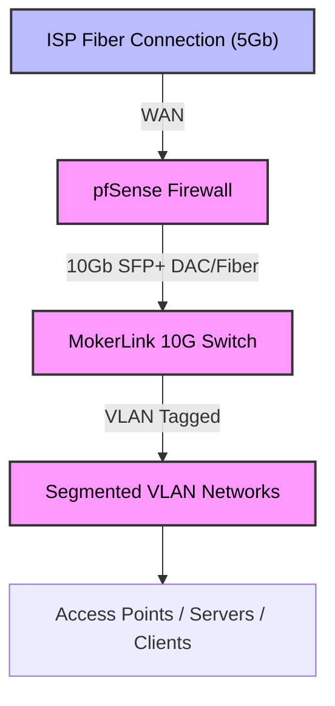
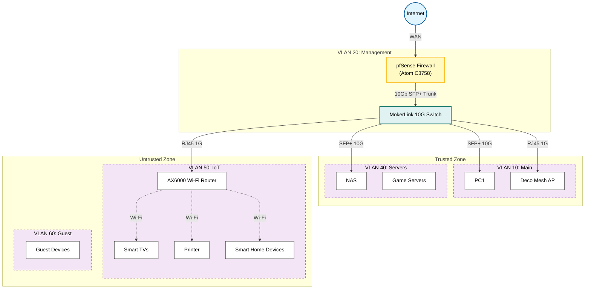

# 🛡️ Home Network Security Lab

A production-grade home network lab designed to simulate **enterprise segmentation**, **firewall policy enforcement**, and **secure infrastructure deployment** using pfSense and managed switching.

This environment serves as a hands-on platform for cybersecurity experimentation, attack simulation, network hardening, and infrastructure security testing.

---

## 📌 Overview

This lab implements full **VLAN segmentation** with firewall-enforced isolation to prevent lateral movement between device classes while maintaining usability for home and lab services.

**Core Goals:**

-   **Separate** trusted and untrusted devices.
-   **Contain** IoT and guest networks to reduce attack surface.
-   **Secure** infrastructure management interfaces.
-   **Enable** realistic attack and defense scenarios.
-   **Maintain** high-speed internal networking.

---

## 🧱 Infrastructure Stack



**Core Technologies:**

-   **pfSense Firewall:** Edge security and inter-VLAN routing running on enterprise-grade hardware.
-   **Managed 10Gb Switch:** Layer 2 segmentation and VLAN tagging via MokerLink 10G0800GTM.
-   **VLAN Segmentation:** Logical isolation of network traffic.
-   **Stateful Firewall Policies:** Granular access control.
-   **DHCP Reservations:** Consistent IP management for infrastructure.
-   **mDNS Reflection:** Service discovery across boundaries.
-   **IoT Containment Architecture:** Zero-trust approach using dedicated APs.

---

## 🧰 Hardware Used

| Component       | Model / Type                     | Purpose                                      |
| :-------------- | :------------------------------- | :------------------------------------------- |
| **Firewall**    | OEM Server Appliance (Atom C3758)| Routing, firewall, VLAN segmentation         |
| **Switch**      | MokerLink 10G0800GTM             | 10GbE Managed Switch for VLAN distribution   |
| **Transceiver** | TP-Link TL-SM5310-T              | 10GBase-T RJ45 SFP+ Module for Copper Uplinks|
| **Main AP**     | Deco Wi-Fi 6E Mesh               | Trusted Wireless client connectivity         |
| **IoT AP**      | AX6000 Next-Gen Wi-Fi Router     | Dedicated IoT/Guest Wireless                 |
| **Servers**     | Home lab servers / PCs           | Lab testing & services                       |
| **Storage**     | NAS / local servers              | Data & lab services                          |

### 🖥️ Hardware Specifications

#### Firewall Appliance
*   **Processor:** Intel Atom C3758 (8-Core, 2.20 GHz, 16 MB Cache, AES-NI & QAT Support).
*   **Memory:** 32GB DDR4 ECC.
*   **Networking:**
    *   4x Intel I350 Gigabit RJ-45.
    *   2x Intel X553 10GbE SFP+ (Note: Supports 1GbE/10GbE only; no 2.5/5GbE support).
*   **Storage:** 256GB M.2 SATA SSD + 16GB eMMC.
*   **I/O:** 2x USB 3.0, 1x Micro-USB Console.

#### SFP+ Connectivity
*   **Module:** TP-Link TL-SM5310-T (10GBase-T RJ45 SFP+).
*   Used to connect the **Firewall's SFP+ LAN interface** to the **MokerLink Switch** or high-speed servers over copper cabling.

---

## 📊 Network Topology



---

## 🌐 VLAN Architecture

| VLAN   | Subnet            | Purpose                             | Access Level    |
| :----- | :---------------- | :---------------------------------- | :-------------- |
| **VLAN10** | `192.168.10.0/24` | Main devices (PCs, phones, laptops) | **Trusted**     |
| **VLAN20** | `192.168.20.0/24` | Infrastructure & management network | **Restricted**  |
| **VLAN30** | `192.168.30.0/24` | Security lab & testing environment  | **Isolated**    |
| **VLAN40** | `192.168.40.0/24` | Servers, NAS, and service hosts     | **Controlled**  |
| **VLAN50** | `192.168.50.0/24` | IoT & smart home devices            | **Contained**   |
| **VLAN60** | `192.168.60.0/24` | Guest network access                | **Internet-only**|

---

## 🔐 Network Security Model

Traffic policies enforce strict segmentation based on the principle of least privilege. This prevents lateral movement if a device (especially an IoT device) becomes compromised.

### Policy Overview

| Source | Destination | Action | Rationale |
| :----- | :---------- | :----- | :-------- |
| **MAIN** | **IoT** | ✅ Allowed | Users need to control smart devices. |
| **IoT** | **MAIN** | ❌ Blocked | Compromised bulbs/fridges shouldn't hack your PC. |
| **IoT** | **MGMT** | ❌ Blocked | Absolute protection for infrastructure. |
| **LAB** | **MAIN** | ❌ Blocked | Malware in the lab stays in the lab. |
| **GUEST** | **Internal** | ❌ Blocked | Guests get internet only, no snooping. |
| **All** | **WAN** | ✅ Allowed | Internet access for all devices. |

> **Why this matters:** In a flat network (192.168.1.x), a compromised smart TV allows an attacker to directly scan and exploit your personal laptop. In this segmented model, the attacker is trapped in VLAN50.

---

## 🖨️ Cross-VLAN Services Enabled

To preserve usability while maintaining segmentation, specific "pinholes" are opened in the firewall:

-   **AirPrint:** Works across VLANs using Avahi (mDNS reflection).
-   **Media Casting:** Smart TVs are reachable from trusted devices.
-   **Printing:** Printer is accessible securely from the main network, but the printer cannot initiate connections back.
-   **Service Discovery:** Enabled via mDNS reflection to allow devices to "see" each other across subnets without full access.

---

## 🧪 Lab Use Cases

This environment supports a wide range of security experiments:

1.  **Attack Path Testing:** Simulate an attacker pivoting from a compromised IoT device.
2.  **Lateral Movement Simulation:** Test detection rules against real traffic.
3.  **Firewall Rule Validation:** Ensure deny rules are actually dropping packets.
4.  **IDS/IPS Experimentation:** Deploy Snort/Suricata on the edge.
5.  **Malware Containment:** Detonate samples in the isolated Lab VLAN.
6.  **Network Traffic Inspection:** Capture PCAP data for analysis.

---

## 📂 Repository Structure

```text
home-network-lab/
├── firewall-rules/
│   └── segmentation-policy.md
├── switch-config/
│   └── vlan-setup.md
└── README.md
```

---

## 🎯 Skills Demonstrated

This lab showcases practical experience in:

-   **Network Segmentation Design:** Planning VLANs for security and function.
-   **Firewall Policy Development:** Writing stateful rulesets.
-   **VLAN Implementation:** Configuring 802.1Q tagging on switches and routers.
-   **Infrastructure Hardening:** Securing management planes.
-   **Attack Surface Reduction:** Minimizing the exposure of critical assets.
-   **Enterprise Architecture:** Applying corporate security patterns to a small network.

---

## 🚀 Future Enhancements

Planned improvements for the lab:

-   [ ] **IDS/IPS Deployment:** Suricata for threat detection.
-   [ ] **VPN Remote Access:** WireGuard for secure remote entry.
-   [ ] **Network Monitoring:** Grafana/Prometheus dashboards.
-   [ ] **Automated Backups:** Ansible playbooks for config management.
-   [ ] **Attack Simulation:** Automated red team scenarios.
-   [ ] **Zero-Trust:** Experimenting with micro-segmentation.

---

## 🧠 Why This Matters

Modern security incidents rely heavily on **lateral movement** after initial compromise. Proper segmentation dramatically reduces the "blast radius" of an infection.

> "Identity is the new perimeter, but the network is still the battlefield."

This lab demonstrates real-world defensive networking principles used in enterprise environments, scaled down for study and experimentation.

---

## 📫 Contact

Open to collaboration, security discussions, and infrastructure design conversations.

---
