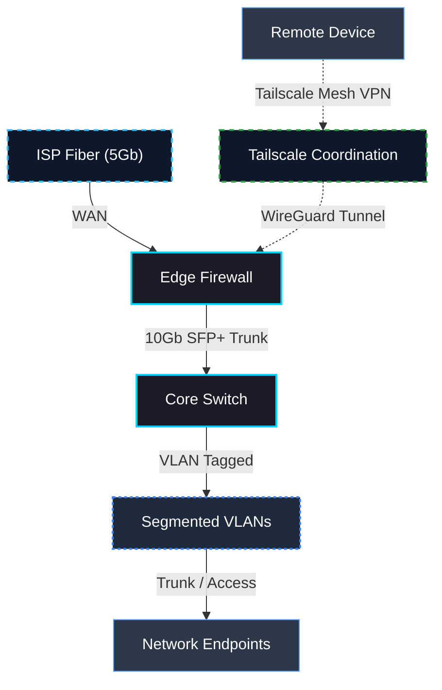
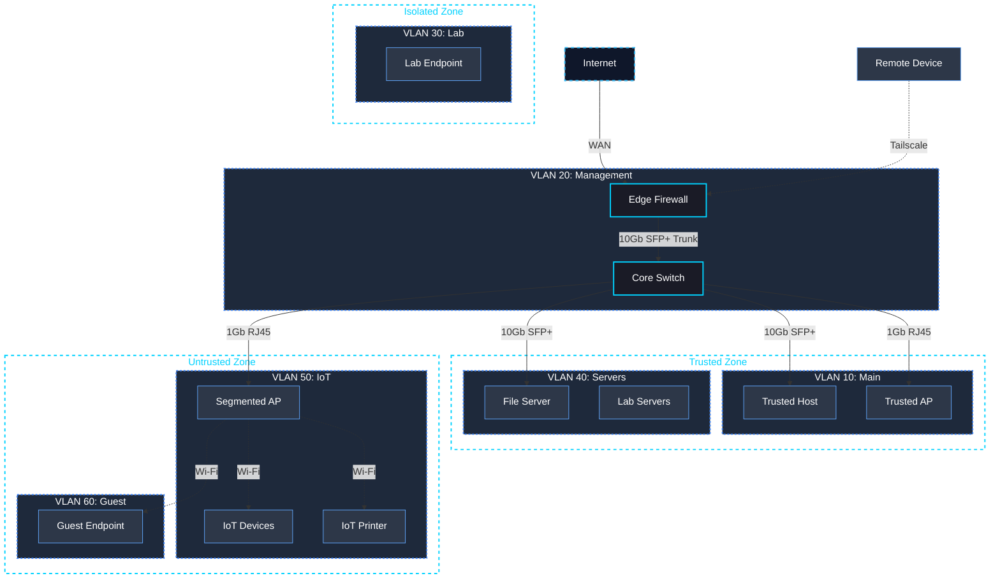

# Home Network Security Lab

A production-grade home network lab implementing **enterprise-style segmentation**, **stateful firewall enforcement**, **zero-trust DNS controls**, and **secure remote access** — built for hands-on cybersecurity experimentation, threat simulation, and SOC skill development.

---

## Overview

This lab enforces strict **VLAN segmentation** with firewall-controlled inter-zone routing to eliminate lateral movement paths between device classes. Every security decision is documented, every rule has a rationale, and logs are structured for SIEM ingestion.

**Core Security Goals:**

- Separate trusted and untrusted devices at Layer 2 and Layer 3.
- Contain IoT and guest traffic — zero ability to reach internal networks.
- Enforce DNS at the network level — no client bypass possible.
- Protect the management plane from all non-administrative access.
- Provide auditable remote access via Tailscale with no open WAN ports.
- Generate clean, SIEM-ready logs through structured noise suppression.

---

## Infrastructure Stack


```mermaid
graph TD
    %% Cyber Sec Grey/Blue Theme
    classDef internet fill:#0f172a,stroke:#38bdf8,stroke-width:2px,color:#ffffff,stroke-dasharray: 5 5;
    classDef firewall fill:#1a1b26,stroke:#00d2ff,stroke-width:2px,color:#ffffff;
    classDef device fill:#2d3748,stroke:#60a5fa,stroke-width:1px,color:#ffffff;
    classDef vlan fill:#1e293b,stroke:#3b82f6,stroke-width:2px,stroke-dasharray: 3 3,color:#ffffff;
    classDef vpn fill:#0f172a,stroke:#2ea043,stroke-width:2px,color:#ffffff,stroke-dasharray: 5 5;

    ISP["ISP Fiber (5Gb)"]:::internet -->|"WAN"| FW["Edge Firewall"]:::firewall
    Remote["Remote Device"]:::device -.->|"Tailscale Mesh VPN"| TS["Tailscale Coordination"]:::vpn
    TS -.->|"WireGuard Tunnel"| FW
    FW -->|"10Gb SFP+ Trunk"| SW["Core Switch"]:::firewall
    SW -->|"VLAN Tagged"| VLANs["Segmented VLANs"]:::vlan
    VLANs -->|"Trunk / Access"| Clients["Network Endpoints"]:::device
```

**Core Technologies:**

- **pfSense Plus:** Edge firewall, inter-VLAN routing, DHCP, Unbound DNS — running on enterprise-grade hardware with QAT and ZFS.
- **Managed 10Gb Switch:** Layer 2 segmentation and 802.1Q VLAN tagging.
- **VLAN Segmentation:** Logical isolation of all traffic by device class and trust level.
- **Stateful Firewall Policies:** Granular ACLs with default-deny inter-VLAN posture.
- **Forced DNS (Unbound):** All VLANs resolve through pfSense — no client bypass honored.
- **Tailscale Remote Access:** Subnet router + exit node + MagicDNS — zero open WAN ports.
- **SOC_SILENCE Framework:** Named noise-suppression rules for clean SIEM-ready log output.

---

## Hardware

| Component | Model / Type | Purpose |
| :--- | :--- | :--- |
| **Firewall Appliance** | OEM Server (Intel Atom C3758) | Edge security, routing, DNS, DHCP |
| **Core Switch** | MokerLink 10G0800GTM | 10GbE managed switching, VLAN distribution |
| **SFP+ Transceiver** | TP-Link TL-SM5310-T | 10GBase-T RJ45 uplink between firewall and switch |
| **Trusted AP** | Wi-Fi 6E Mesh System | Trusted zone wireless connectivity |
| **Segmented AP** | Next-Gen Wi-Fi Router | Dedicated IoT and guest wireless isolation |
| **Lab Servers** | Home lab server hardware | Security lab testing and hosted services |
| **Storage** | NAS appliance | Data and service hosting |

### Firewall Appliance Specifications

- **Processor:** Intel Atom C3758 (8-core, 2.20 GHz) — AES-NI + QAT hardware acceleration enabled.
- **Memory:** 32 GB DDR4 ECC.
- **Networking:** 4x Intel I350 GbE RJ-45 + 2x Intel X553 10GbE SFP+.
- **Storage:** 256 GB M.2 SATA SSD + 16 GB eMMC — ZFS filesystem.
- **OS:** pfSense Plus (upgraded from CE) — enables QAT driver support and improved ZFS integration.

> **Why pfSense Plus:** The CE → Plus upgrade unlocked QAT hardware crypto offloading (accelerates VPN/TLS handshakes) and first-class ZFS support for filesystem integrity and snapshot-based backups.

---

## Network Topology


```mermaid
flowchart TB
    %% Cyber Sec Grey/Blue Theme
    classDef internet fill:#0f172a,stroke:#38bdf8,stroke-width:2px,color:#ffffff,stroke-dasharray: 5 5;
    classDef firewall fill:#1a1b26,stroke:#00d2ff,stroke-width:2px,color:#ffffff;
    classDef vlan fill:#1e293b,stroke:#3b82f6,stroke-width:2px,stroke-dasharray: 3 3,color:#ffffff;
    classDef device fill:#2d3748,stroke:#60a5fa,stroke-width:1px,color:#ffffff;
    classDef zone fill:#00000000,stroke:#00d2ff,stroke-width:2px,color:#00d2ff,stroke-dasharray: 5 5;
    classDef vpn fill:#0f172a,stroke:#2ea043,stroke-width:2px,color:#ffffff,stroke-dasharray: 5 5;

    Internet["Internet"]:::internet -->|"WAN"| EdgeFW["Edge Firewall"]:::firewall
    RemoteDevice["Remote Device"]:::device -.->|"Tailscale"| EdgeFW

    EdgeFW -->|"10Gb SFP+ Trunk"| CoreSW["Core Switch"]:::firewall

    subgraph Infrastructure ["VLAN 20: Management"]
        direction TB
        EdgeFW
        CoreSW
    end
    class Infrastructure vlan;

    subgraph Trusted_Zone ["Trusted Zone"]
        direction TB
        subgraph VLAN10 ["VLAN 10: Main"]
            direction LR
            TrustedHost["Trusted Host"]:::device
            TrustedAP["Trusted AP"]:::device
        end
        class VLAN10 vlan;

        subgraph VLAN40 ["VLAN 40: Servers"]
            direction LR
            FileServer["File Server"]:::device
            LabServers["Lab Servers"]:::device
        end
        class VLAN40 vlan;
    end
    class Trusted_Zone zone;

    subgraph Untrusted_Zone ["Untrusted Zone"]
        direction TB
        subgraph VLAN50 ["VLAN 50: IoT"]
            direction LR
            SegmentedAP["Segmented AP"]:::device
            IoTDevices["IoT Devices"]:::device
            IoTPrinter["IoT Printer"]:::device
        end
        class VLAN50 vlan;

        subgraph VLAN60 ["VLAN 60: Guest"]
            direction LR
            GuestEndpoint["Guest Endpoint"]:::device
        end
        class VLAN60 vlan;
    end
    class Untrusted_Zone zone;

    subgraph Isolated_Zone ["Isolated Zone"]
        subgraph VLAN30 ["VLAN 30: Lab"]
            direction LR
            LabEndpoint["Lab Endpoint"]:::device
        end
        class VLAN30 vlan;
    end
    class Isolated_Zone zone;

    %% Physical Connections
    CoreSW -->|"10Gb SFP+"| TrustedHost
    CoreSW -->|"1Gb RJ45"| TrustedAP
    CoreSW -->|"10Gb SFP+"| FileServer
    CoreSW -->|"1Gb RJ45"| SegmentedAP

    %% Logical Connections
    SegmentedAP -.->|"Wi-Fi"| IoTDevices
    SegmentedAP -.->|"Wi-Fi"| IoTPrinter
    SegmentedAP -.->|"Wi-Fi"| GuestEndpoint
```

---

## VLAN Architecture

| VLAN | Subnet | Purpose | Trust Level |
| :--- | :--- | :--- | :--- |
| **VLAN 10** | `192.168.10.0/24` | Primary devices — workstations, phones, laptops | **Trusted** |
| **VLAN 20** | `192.168.20.0/24` | Infrastructure and management interfaces | **Restricted** |
| **VLAN 30** | `192.168.30.0/24` | Security lab — malware testing, attack simulation | **Isolated** |
| **VLAN 40** | `192.168.40.0/24` | Servers, NAS, hosted services | **Controlled** |
| **VLAN 50** | `192.168.50.0/24` | IoT and smart home devices | **Contained** |
| **VLAN 60** | `192.168.60.0/24` | Guest network — internet-only access | **Internet-only** |

---

## Network Security Model

Traffic policy enforces strict least-privilege segmentation. Inter-VLAN routing is denied by default — only explicit allow rules pass traffic.

| Source | Destination | Policy | Rationale |
| :--- | :--- | :--- | :--- |
| **Main** | **IoT** | Allow | Users initiate control of smart devices. |
| **IoT** | **Main** | Block | Compromised IoT cannot reach workstations. |
| **IoT** | **Management** | Block | Absolute infrastructure protection. |
| **Lab** | **Main** | Block | Malware in the lab stays in the lab. |
| **Guest** | **Internal** | Block | Guests get internet only — no lateral access. |
| **All VLANs** | **DNS (port 53)** | Forced to Unbound | Clients cannot use external resolvers. |
| **All VLANs** | **DoT (port 853)** | Block | Prevents TLS-based DNS bypass. |
| **Remote** | **Network** | Tailscale only | Zero open WAN ports; all other inbound denied. |

---

## Attack Surface Overview

| Attack Vector | Exposed Surface | Mitigation | Residual Risk |
| :--- | :--- | :--- | :--- |
| **WAN Inbound** | Tailscale UDP 41641 only | All other inbound explicitly blocked | Low |
| **IoT Compromise** | VLAN 50 — segmented | DNS NAT override; no inbound initiation; RFC1918 blocked | Contained |
| **Guest Pivot** | VLAN 60 — internet-only | Hard block to all RFC 1918 space | None |
| **DNS Hijack / Exfil** | All VLANs | Forced Unbound; DoT blocked; IoT NAT override | Low |
| **Unauthorized Remote Access** | Tailscale mesh | No open ports; device + user auth required via Tailscale | Low |
| **Lateral Movement** | Inter-VLAN paths | Default-deny firewall; stateful ACLs; VLAN isolation | Low |

---

## Cross-VLAN Services

Specific firewall pinholes preserve usability without compromising segmentation:

- **AirPrint:** Avahi mDNS reflection enables printing from trusted VLANs to IoT-segment printer.
- **Media Discovery:** Trusted hosts can initiate casting to IoT-side media devices.
- **Service Discovery:** mDNS reflection scoped to specific service types — no full subnet access granted.

---

## Lab Use Cases

This environment supports a wide range of security experiments:

1. **Lateral Movement Simulation** — Attempt pivoting from a compromised IoT device.
2. **Firewall Rule Validation** — Confirm deny rules are actually dropping packets with PCAP.
3. **DNS Enforcement Testing** — Verify clients cannot bypass Unbound using hardcoded resolvers.
4. **Attack Path Testing** — Test kill-chain scenarios from VLAN30 lab to Trusted Zone.
5. **IDS/IPS Experimentation** — Deploy Suricata on the edge for threat detection.
6. **Log Analysis and SIEM Prep** — Analyze firewall logs for recon patterns and build detection rules.

---

## Repository Structure

```text
home-network-lab/
├── network-core/
│   ├── README.md
│   └── switch-config/
│       └── vlan-setup.md
└── security/
    ├── README.md
    ├── firewall-rules/
    │   ├── segmentation-policy.md
    │   ├── wan-rules.md
    │   ├── lan-rules.md
    │   └── vlan50-iot-rules.md
    ├── dns/
    │   └── README.md
    ├── vpn-access/
    │   └── README.md
    └── log-analysis/
        ├── README.md
        └── reports/
            ├── report-template.md
            └── 2026-04-analysis.md
```

---

## Skills Demonstrated

This lab showcases practical experience with:

- **Network Segmentation Design** — Planning and implementing VLANs for security and function.
- **Firewall Policy Development** — Writing stateful rulesets with documented rationale.
- **VLAN Implementation** — Configuring 802.1Q tagging across managed switching and routing.
- **Zero-Trust Architecture** — Micro-segmentation with per-device trust groups.
- **DNS Security Enforcement** — Forced resolver, DoT blocking, DNSSEC, encrypted upstream (Cloudflare + Quad9).
- **VPN Architecture** — Tailscale subnet routing, exit node, and MagicDNS integration.
- **SOC Log Tuning** — Building SOC_SILENCE noise suppression frameworks for SIEM-ready output.
- **Traffic Analysis** — Identifying reconnaissance patterns, port scan signatures, and threat actor behaviour in real firewall logs.
- **Infrastructure Hardening** — Management plane isolation, attack surface reduction.
- **Hardware Crypto Acceleration** — QAT integration for VPN and TLS workload offloading.

---

## Roadmap

| Status | Enhancement |
| :--- | :--- |
| **Done** | Zero-trust VLAN micro-segmentation |
| **Done** | pfSense Plus — QAT hardware crypto + ZFS filesystem |
| **Done** | Tailscale remote access — subnet router + exit node + MagicDNS |
| **Done** | Forced DNS enforcement — Unbound + Cloudflare/Quad9 + DoT blocking |
| **Done** | SOC log tuning — SOC_SILENCE noise suppression framework |
| Planned | SIEM integration — Wazuh or Elastic for log correlation and alerting |
| Planned | Threat intel enrichment — AbuseIPDB / VirusTotal IP reputation |
| Planned | Detection rules — scan detection, anomaly correlation |
| Planned | IDS/IPS — Suricata for inline threat detection |
| Planned | Network monitoring — Grafana / Prometheus dashboards |
| Planned | Adblocker / DNS sinkhole — pfBlockerNG for malicious domain filtering |
| Planned | Automated config backups — Ansible playbooks |

---

## Why This Matters

Modern security incidents rely on **lateral movement** after initial compromise. Proper segmentation eliminates the paths attackers need to escalate from a compromised IoT device to critical infrastructure.

> "The network is still the battlefield — but a well-segmented one is a battlefield the attacker cannot navigate."

This lab demonstrates real-world defensive networking principles found in enterprise environments, scaled for hands-on study and experimentation.

---

## Contact

Open to collaboration, security discussions, and infrastructure design conversations.
