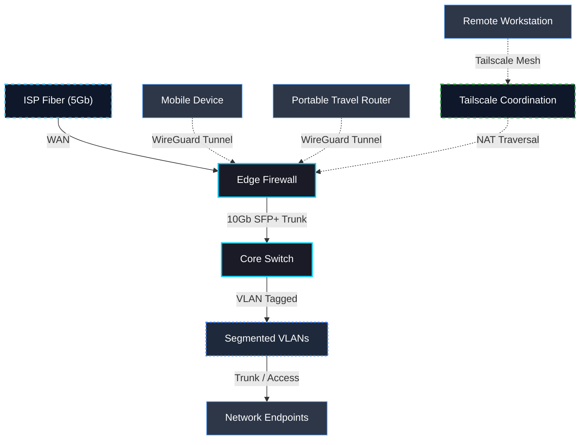
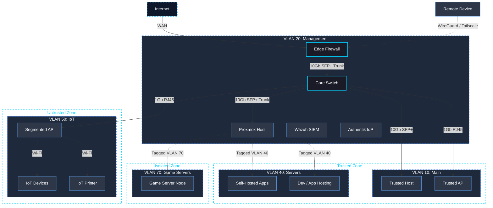

# Home Network Security Lab

A production-grade home network lab implementing **enterprise-style segmentation**, **stateful firewall enforcement**, **zero-trust DNS controls**, and **secure remote access** — built for hands-on cybersecurity experimentation, threat simulation, and SOC skill development.

> **Last reviewed:** August 2026 — documentation verified against the running configuration.

---

## Overview

This lab enforces strict **VLAN segmentation** with firewall-controlled inter-zone routing to eliminate lateral movement paths between device classes. Every security decision is documented, every rule has a rationale, and logs are structured for SIEM ingestion.

**Core Security Goals:**

- Separate trusted and untrusted devices at Layer 2 and Layer 3.
- Contain IoT and game-server traffic — zero ability to reach internal networks.
- Enforce DNS at the network level on untrusted segments — no client bypass possible.
- Protect the management plane from all non-administrative access.
- Keep the inbound attack surface to authenticated VPN listeners and nothing else.
- Generate clean, SIEM-ready logs through structured noise suppression.

---

## Infrastructure Stack

```mermaid
graph TD
    %% Cyber Sec Grey/Blue Theme
    classDef internet fill:#0f172a,stroke:#38bdf8,stroke-width:2px,color:#ffffff,stroke-dasharray: 5 5;
    classDef firewall fill:#1a1b26,stroke:#00d2ff,stroke-width:2px,color:#ffffff;
    classDef device fill:#2d3748,stroke:#60a5fa,stroke-width:1px,color:#ffffff;
    classDef vlan fill:#1e293b,stroke:#3b82f6,stroke-width:2px,stroke-dasharray: 3 3,color:#ffffff;
    classDef vpn fill:#0f172a,stroke:#2ea043,stroke-width:2px,color:#ffffff,stroke-dasharray: 5 5;

    ISP["ISP Fiber (5Gb)"]:::internet -->|"WAN"| FW["Edge Firewall"]:::firewall
    Mobile["Mobile Device"]:::device -.->|"WireGuard Tunnel"| FW
    TravelRouter["Portable Travel Router"]:::device -.->|"WireGuard Tunnel"| FW
    Remote["Remote Workstation"]:::device -.->|"Tailscale Mesh"| TS["Tailscale Coordination"]:::vpn
    TS -.->|"NAT Traversal"| FW
    FW -->|"10Gb SFP+ Trunk"| SW["Core Switch"]:::firewall
    SW -->|"VLAN Tagged"| VLANs["Segmented VLANs"]:::vlan
    VLANs -->|"Trunk / Access"| Clients["Network Endpoints"]:::device
```

**Core Technologies:**

- **pfSense Plus:** Edge firewall, inter-VLAN routing, DHCP, Unbound DNS — running on enterprise-grade hardware with QAT and ZFS.
- **Managed 10Gb Switch:** Layer 2 segmentation and 802.1Q VLAN tagging.
- **VLAN Segmentation:** Logical isolation of all traffic by device class and trust level.
- **Stateful Firewall Policies:** Granular ACLs with default-deny inter-VLAN posture.
- **Forced DNS (Unbound):** Untrusted segments are NAT-redirected to the local resolver — no client bypass honored. Upstream leaves the firewall over DNS-over-TLS.
- **Remote Access:** Firewall-terminated WireGuard tunnels for mobile and portable use, plus a Tailscale mesh for workstation access — see [VPN & Remote Access](./security/vpn-access/README.md).
- **Proxmox Virtualization:** Hypervisor hosting the SIEM, identity provider, and self-hosted services across segmented VLANs.
- **SOC_SILENCE Framework:** Named noise-suppression rules for clean SIEM-ready log output.

---

## Hardware

| Component | Model / Type | Purpose |
| :--- | :--- | :--- |
| **Firewall Appliance** | OEM Server (Intel Atom C3758) | Edge security, routing, DNS, DHCP |
| **Core Switch** | MokerLink 10G0800GTM | 10GbE managed switching, VLAN distribution |
| **SFP+ Transceiver** | TP-Link TL-SM5310-T | 10GBase-T RJ45 uplink between firewall and switch |
| **Trusted AP** | Wi-Fi 6E Mesh System | Trusted zone wireless connectivity |
| **Segmented AP** | Next-Gen Wi-Fi Router | Dedicated IoT wireless isolation |
| **Proxmox Host** | Lenovo M70q (i7-12th gen, 64GB RAM) | Primary virtualization node for servers and core services |
| **Wazuh Manager** | Ubuntu Server Pro VM | Primary SIEM and log aggregation platform (Livepatch & USG Hardened) |
| **Authentik** | Ubuntu Server Pro VM | Centralized Identity Provider (IdP) for Zero Trust passkey access (Livepatch & USG Hardened) |
| **Game Server Control Plane** | Isolated VM (VLAN 40) | Panel that orchestrates the game node without sharing its segment |
| **Game Server Node** | Isolated VM (VLAN 70) | Game workload under dedicated ZTNA rules |

### Firewall Appliance Specifications

- **Processor:** Intel Atom C3758 (8-core, 2.20 GHz) — AES-NI + QAT hardware acceleration enabled.
- **Memory:** 32 GB DDR4 ECC.
- **Networking:** 4x Intel I350 GbE RJ-45 + 2x Intel X553 10GbE SFP+.
- **Storage:** 256 GB M.2 SATA SSD + 16 GB eMMC — ZFS filesystem.
- **OS:** pfSense Plus (upgraded from CE) — enables QAT driver support and improved ZFS integration.

> **Why pfSense Plus:** The CE → Plus upgrade unlocked QAT hardware crypto offloading (accelerates VPN/TLS handshakes) and first-class ZFS support for filesystem integrity and snapshot-based backups.

---

## 🌟 Recruiter Showcase: Enterprise SIEM & Zero Trust

If you are a recruiter or hiring manager reviewing this repository, please check out the dedicated **[Wazuh SIEM & Threat Intelligence Showcase](./security/wazuh.md)**.

This document provides a high-level, business-focused overview of how I deployed Wazuh on **Ubuntu Server Pro** utilizing **Canonical Livepatch** and achieved a **92% CIS Level 2** compliance score, demonstrating enterprise-grade security operations (SecOps) capabilities within this lab.

---

## Network Topology

```mermaid
flowchart TB
    %% Cyber Sec Grey/Blue Theme
    classDef internet fill:#0f172a,stroke:#38bdf8,stroke-width:2px,color:#ffffff,stroke-dasharray: 5 5;
    classDef firewall fill:#1a1b26,stroke:#00d2ff,stroke-width:2px,color:#ffffff;
    classDef vlan fill:#1e293b,stroke:#3b82f6,stroke-width:2px,stroke-dasharray: 3 3,color:#ffffff;
    classDef device fill:#2d3748,stroke:#60a5fa,stroke-width:1px,color:#ffffff;
    classDef zone fill:#00000000,stroke:#00d2ff,stroke-width:2px,color:#00d2ff,stroke-dasharray: 5 5;
    classDef vpn fill:#0f172a,stroke:#2ea043,stroke-width:2px,color:#ffffff,stroke-dasharray: 5 5;

    Internet["Internet"]:::internet -->|"WAN"| EdgeFW["Edge Firewall"]:::firewall
    RemoteDevice["Remote Device"]:::device -.->|"WireGuard / Tailscale"| EdgeFW

    EdgeFW -->|"10Gb SFP+ Trunk"| CoreSW["Core Switch"]:::firewall

    subgraph Infrastructure ["VLAN 20: Management"]
        direction TB
        EdgeFW
        CoreSW
        Hypervisor["Proxmox Host"]:::device
        SIEM["Wazuh SIEM"]:::device
        IdP["Authentik IdP"]:::device
    end
    class Infrastructure vlan;

    subgraph Trusted_Zone ["Trusted Zone"]
        direction TB
        subgraph VLAN10 ["VLAN 10: Main"]
            direction LR
            TrustedHost["Trusted Host"]:::device
            TrustedAP["Trusted AP"]:::device
        end
        class VLAN10 vlan;

        subgraph VLAN40 ["VLAN 40: Servers"]
            direction LR
            AppServers["Self-Hosted Apps"]:::device
            DevServer["Dev / App Hosting"]:::device
        end
        class VLAN40 vlan;
    end
    class Trusted_Zone zone;

    subgraph Untrusted_Zone ["Untrusted Zone"]
        direction TB
        subgraph VLAN50 ["VLAN 50: IoT"]
            direction LR
            SegmentedAP["Segmented AP"]:::device
            IoTDevices["IoT Devices"]:::device
            IoTPrinter["IoT Printer"]:::device
        end
        class VLAN50 vlan;
    end
    class Untrusted_Zone zone;

    subgraph Isolated_Zone ["Isolated Zone"]
        subgraph VLAN70 ["VLAN 70: Game Servers"]
            direction LR
            GameNode["Game Server Node"]:::device
        end
        class VLAN70 vlan;
    end
    class Isolated_Zone zone;

    %% Physical Connections
    CoreSW -->|"10Gb SFP+"| TrustedHost
    CoreSW -->|"1Gb RJ45"| TrustedAP
    CoreSW -->|"10Gb SFP+ Trunk"| Hypervisor
    CoreSW -->|"1Gb RJ45"| SegmentedAP

    %% Logical Connections
    Hypervisor -.->|"Tagged VLAN 40"| AppServers
    Hypervisor -.->|"Tagged VLAN 40"| DevServer
    Hypervisor -.->|"Tagged VLAN 70"| GameNode
    SegmentedAP -.->|"Wi-Fi"| IoTDevices
    SegmentedAP -.->|"Wi-Fi"| IoTPrinter
```

---

## VLAN Architecture

| VLAN | Subnet | Purpose | Trust Level |
| :--- | :--- | :--- | :--- |
| **VLAN 10** | `192.168.10.0/24` | Primary devices — workstations, phones, laptops | **Trusted** |
| **VLAN 20** | `192.168.20.0/24` | Infrastructure and management interfaces — hypervisor, SIEM, IdP | **Restricted** |
| **VLAN 40** | `192.168.40.0/24` | Servers, self-hosted applications, development hosting | **Controlled** |
| **VLAN 50** | `192.168.50.0/24` | IoT and smart home devices | **Contained** |
| **VLAN 70** | `192.168.70.0/24` | Game servers — strict ZTNA isolation | **Isolated** |

Each VLAN's `.1` address is both its default gateway and its DNS resolver. There is no separate DNS host — the firewall answers DNS for every segment it routes, which is what makes network-level DNS enforcement possible.

---

## Virtualisation & Hosted Services

A single Proxmox node hosts the lab's services, each placed on the VLAN matching its trust level rather than lumped onto one flat server network. Addresses are deliberately omitted from this repository.

| Service | Role | VLAN | Trust Rationale |
| :--- | :--- | :--- | :--- |
| **Proxmox VE** | Hypervisor and management plane | 20 | Management interfaces never share a segment with workloads |
| **Wazuh** | SIEM, XDR, FIM, vulnerability detection | 20 | Log destination must survive compromise of any monitored segment |
| **Authentik** | Identity provider — OIDC + passkey enforcement | 20 | Authentication authority sits inside the protected management plane |
| **Web SSH Jump Host** | Browser-based SSH gateway to other segments | 40 | Single audited entry point instead of per-segment SSH exposure |
| **File Sync** | Self-hosted file storage and sync | 40 | Holds data, so it stays out of both management and untrusted zones |
| **Home Automation** | Home Assistant controller | 40 | Needs to *initiate* to IoT, so it is placed above IoT, never inside it |
| **Media Server** | Self-hosted media streaming | 40 | Standard application workload |
| **Dev / App Hosting** | Local Next.js and Vite deployments | 40 | Untrusted-by-default code runs away from the management plane |

> **Design note:** Home automation is the clearest example of the model. The controller must reach IoT devices constantly, but the reverse is never required — so it lives on the Servers VLAN with an explicit outbound allow, and the IoT segment still cannot initiate a single connection back.

---

## Network Security Model

Traffic policy enforces strict least-privilege segmentation. Inter-VLAN routing is denied by default — only explicit allow rules pass traffic.

| Source | Destination | Policy | Rationale |
| :--- | :--- | :--- | :--- |
| **Main** | **IoT** | Allow | Users initiate control of smart devices. |
| **IoT** | **Main** | Block | Compromised IoT cannot reach workstations. |
| **IoT** | **Management** | Block | Absolute infrastructure protection. |
| **Game Servers** | **Internal** | Block | Internet-facing workloads stay contained; only the SIEM agent path is permitted out. |
| **Servers** | **Management** | Block | Application compromise cannot pivot to the hypervisor or SIEM. |
| **IoT / Game Servers** | **DNS (port 53)** | Forced to Unbound | Untrusted segments are NAT-redirected; external resolvers are unreachable. |
| **All VLANs** | **DoT (port 853)** | Block | Prevents TLS-based DNS bypass — the resolver already uses DoT upstream. |
| **Remote** | **Network** | VPN only | Inbound WAN is limited to authenticated VPN listeners; all other inbound denied. |

---

## Trusted Admin Path

Default-deny between segments is the rule for every device on the network **except** a named alias of administrative endpoints, which is permitted to cross into any VLAN.

| Property | Implementation |
| :--- | :--- |
| **Mechanism** | A pfSense alias containing a small, fixed set of admin devices |
| **Scope** | Cross-VLAN reach including management ports on the firewall itself |
| **Why it exists** | Segmentation without a break-glass path produces shadow workarounds — an admin locked out of their own management plane will eventually punch a wider hole than this one |
| **Containment** | Membership is explicit and enumerable; every other host, including every server on VLAN 40, is subject to full default-deny |
| **Residual risk** | Compromise of an admin endpoint bypasses segmentation. Mitigated by passkey-enforced SSO on management interfaces and SIEM monitoring of the alias's traffic |

> **Why document it:** Publishing a segmentation model while quietly running a device that ignores it would misrepresent the posture. The honest version — a deliberate, minimal, monitored exception — is the one that survives an interview.

---

## Attack Surface Overview

| Attack Vector | Exposed Surface | Mitigation | Residual Risk |
| :--- | :--- | :--- | :--- |
| **WAN Inbound** | WireGuard listeners only | All other inbound explicitly blocked; legacy game-server port forwards disabled | Low |
| **IoT Compromise** | VLAN 50 — segmented | DNS NAT override; no inbound initiation; RFC1918 blocked | Contained |
| **Game Server Compromise** | VLAN 70 — isolated | ZTNA ruleset; egress limited to updates and the SIEM agent | Contained |
| **DNS Hijack / Exfil** | All VLANs | Forced Unbound on untrusted segments; DoT blocked; DoT upstream | Low |
| **Unauthorized Remote Access** | WireGuard + Tailscale | Key-based peer auth; device and user authentication on the mesh | Low |
| **Lateral Movement** | Inter-VLAN paths | Default-deny firewall; stateful ACLs; VLAN isolation | Low |
| **Admin Endpoint Compromise** | Trusted admin alias | Explicit membership; passkey SSO on management; SIEM monitoring | Accepted |

---

## Cross-VLAN Services

Specific firewall pinholes preserve usability without compromising segmentation:

- **AirPrint:** Avahi mDNS reflection enables printing from trusted VLANs to the IoT-segment printer, scoped to a single reserved printer address.
- **Home Automation:** The controller on VLAN 40 initiates to IoT devices; the reverse direction stays blocked.
- **Game Server Control Plane:** The panel on VLAN 40 reaches its isolated node on VLAN 70 over specific application and file-transfer ports only.
- **Service Discovery:** mDNS reflection scoped to specific service types — no full subnet access granted.

---

## Lab Use Cases

This environment supports a wide range of security experiments:

1. **Lateral Movement Simulation** — Attempt pivoting from a compromised IoT device toward the trusted and management zones.
2. **Firewall Rule Validation** — Confirm deny rules are actually dropping packets with PCAP.
3. **DNS Enforcement Testing** — Verify IoT clients cannot bypass Unbound using hardcoded resolvers.
4. **Game Server Containment Testing** — Treat the internet-facing node as compromised and enumerate what it can still reach.
5. **IDS/IPS Experimentation** — Evaluate inline detection at the edge.
6. **Log Analysis and SIEM Prep** — Analyze firewall logs for recon patterns and build detection rules.

---

## Repository Structure

- [network-core/](./network-core/) - Physical topology, switching, and hypervisor networking
  - [switch-config/](./network-core/switch-config/) - VLAN creation and port assignment
  - [proxmox-networking.md](./network-core/proxmox-networking.md) - Hypervisor bridge, trunking, and VM placement
- [security/](./security/) - All security documentation
  - [wazuh.md](./security/wazuh.md) - SIEM deployment showcase
  - [firewall-rules/](./security/firewall-rules/) - Segmentation policy, WAN/LAN/IoT rulesets, and Game Server ZTNA
  - [dns/](./security/dns/) - Forced DNS enforcement, DoT blocking, and Unbound configuration
  - [vpn-access/](./security/vpn-access/) - WireGuard tunnels and Tailscale mesh access
  - [log-analysis/](./security/log-analysis/) - Firewall log analysis methodology, Wazuh hardening, and reports
  - [iam/](./security/iam/) - Identity and Access Management (Authentik passkeys)

---

## Skills Demonstrated

This lab showcases practical experience with:

- **Network Segmentation Design** — Planning and implementing VLANs for security and function.
- **Firewall Policy Development** — Writing stateful rulesets with documented rationale.
- **VLAN Implementation** — Configuring 802.1Q tagging across managed switching and routing.
- **Zero-Trust Architecture** — Micro-segmentation with per-device trust groups.
- **DNS Security Enforcement** — Forced resolver, DoT blocking, DNSSEC, encrypted upstream (Cloudflare + Quad9).
- **VPN Architecture** — Firewall-terminated WireGuard alongside a coordinated mesh overlay, and the trade-offs between the two models.
- **SIEM Operations** — Wazuh deployment, agent onboarding, host hardening to CIS Level 2, and compliance dashboards.
- **Identity & Access Management** — OIDC single sign-on with passkey enforcement on hypervisor administration.
- **Virtualization & Service Placement** — Mapping workloads to trust zones on a segmented hypervisor.
- **SOC Log Tuning** — Building SOC_SILENCE noise suppression frameworks for SIEM-ready output.
- **Traffic Analysis** — Identifying reconnaissance patterns, port scan signatures, and threat actor behaviour in real firewall logs.
- **Infrastructure Hardening** — Management plane isolation, attack surface reduction.
- **Hardware Crypto Acceleration** — QAT integration for VPN and TLS workload offloading.

---

## Roadmap

| Status | Enhancement |
| :--- | :--- |
| **Done** | Zero-trust VLAN micro-segmentation |
| **Done** | pfSense Plus — QAT hardware crypto + ZFS filesystem |
| **Done** | Remote access — WireGuard tunnels + Tailscale mesh with subnet routing |
| **Done** | Forced DNS enforcement — Unbound + Cloudflare/Quad9 + DoT blocking |
| **Done** | SOC log tuning — SOC_SILENCE noise suppression framework |
| **Done** | SIEM integration — Wazuh manager with agent onboarding and compliance dashboards |
| **Done** | Identity provider — Authentik OIDC SSO with passkey-enforced hypervisor access |
| **Done** | Game server ZTNA — isolated VLAN 70 node with a segmented control plane |
| **Done** | Dev server web app hosting — Next.js and Vite local deployments |
| Planned | pfSense syslog forwarding into Wazuh with custom decoders |
| Planned | Threat intel enrichment — AbuseIPDB / VirusTotal IP reputation |
| Planned | Detection rules — scan detection, anomaly correlation |
| Planned | IDS/IPS — Suricata for inline threat detection |
| Planned | Network monitoring — Grafana / Prometheus dashboards |
| Planned | Adblocker / DNS sinkhole — pfBlockerNG for malicious domain filtering |
| Planned | Automated config backups — Ansible playbooks |

---

## Why This Matters

Modern security incidents rely on **lateral movement** after initial compromise. Proper segmentation eliminates the paths attackers need to escalate from a compromised IoT device to critical infrastructure.

> "The network is still the battlefield — but a well-segmented one is a battlefield the attacker cannot navigate."

This lab demonstrates real-world defensive networking principles found in enterprise environments, scaled for hands-on study and experimentation.

---

## Contact

Open to collaboration, security discussions, and infrastructure design conversations.
