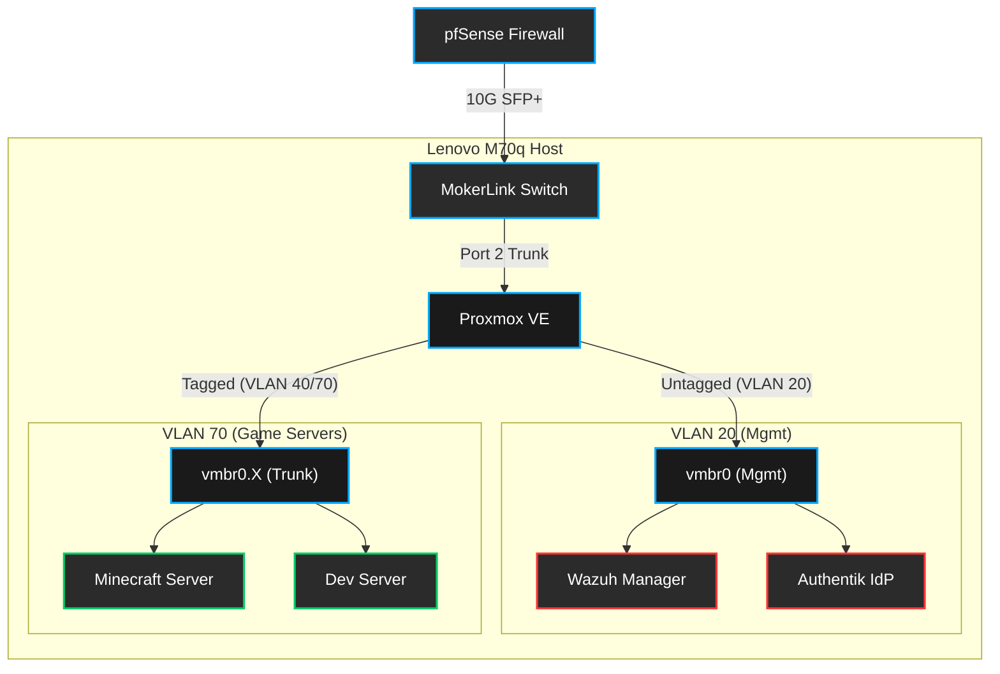

# 🖥️ Proxmox Virtual Infrastructure

This document details the hardware and virtual networking configuration for the primary virtualization host (Lenovo M70q), specifically focusing on segmentation, VLAN tagging, and the integration of core services like Wazuh and Authentik.

---

## 💻 Hardware Specifications

The virtualization host is a micro form-factor system optimized for high core count and memory capacity to support multiple isolated virtual environments.

* **Model:** Lenovo M70q
* **CPU:** Intel Core i7-12th Gen T-Series
* **Memory:** 64GB DDR4 (3200MHz)
* **Hypervisor:** Proxmox VE

> **Security Rationale:** Utilizing an energy-efficient micro node allows for continuous operation with reduced thermal footprint while providing sufficient computational resources to segment services securely via virtualization rather than relying on containerized isolation on a single host.

---

## 🔌 Physical & Virtual Networking

The Proxmox host is connected to **Port 2** on the MokerLink switch. To support both secure management access and segmented virtual machines, this port is configured as a trunk.

### Switch Port 2 Configuration
* **Native (Untagged):** VLAN 20 (Mgmt) - `192.168.20.0/24`
* **Tagged:** VLAN 40 (Servers) - `192.168.40.0/24`
* **Tagged:** VLAN 70 (Game Servers) - `192.168.70.0/24`

> **Security Rationale:** Running the management interface untagged on VLAN 20 ensures that the Proxmox host is isolated strictly to the Management VLAN. Tagging the guest network VLANs (40 and 70) ensures that VMs are segmented at the hypervisor bridge level, preventing inter-VM communication without passing through the pfSense firewall's inspection engine.

### VM Placement & Segmentation

| Virtual Machine | Primary Function | Assigned VLAN | Subnet |
| :--- | :--- | :--- | :--- |
| **Proxmox Host** | Hypervisor / Management | 20 (Mgmt) | `192.168.20.0/24` |
| **Wazuh Manager** | SIEM / Log Aggregation | 20 (Mgmt) | `192.168.20.0/24` |
| **Authentik** | Identity Provider (IdP) | 20 (Mgmt) | `192.168.20.0/24` |
| **Dev Server** | Local App Testing | 70 (Game Servers) | `192.168.70.0/24` |
| **Game Server** | Minecraft Server | 70 (Game Servers) | `192.168.70.0/24` |

---

## 🗺️ Topology Diagram

