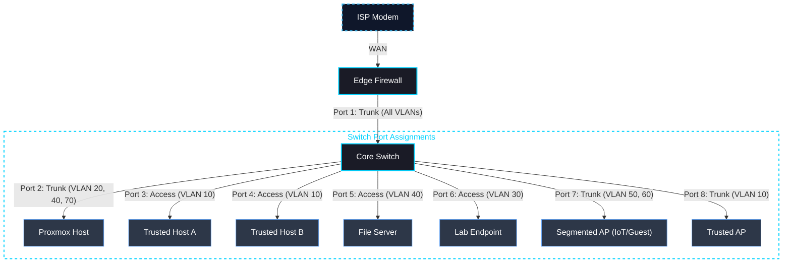

# VLAN Setup Guide

## Overview

This document describes how VLANs are implemented across the managed switch and edge firewall. The configuration enforces **network segmentation**, improves **security posture**, and supports lab experimentation without affecting trusted devices.

The **edge firewall** performs inter-VLAN routing (Layer 3) and firewall enforcement. The **managed switch** handles VLAN tagging and port membership (Layer 2).

---

## Network Topology Flow

**Roles:**
- **Edge Firewall:** DHCP per VLAN, firewall filtering, Unbound DNS, inter-VLAN routing.
- **Core Switch:** 802.1Q VLAN tagging, port isolation, Layer 2 distribution.

---

## VLAN Layout

| VLAN ID | Name | Subnet | Gateway | Primary Use Case |
| :--- | :--- | :--- | :--- | :--- |
| **10** | `MAIN` | `192.168.10.0/24` | `192.168.10.1` | Workstations, laptops, daily devices |
| **20** | `MGMT` | `192.168.20.0/24` | `192.168.20.1` | Firewall, switch, and AP management |
| **30** | `LAB` | `192.168.30.0/24` | `192.168.30.1` | Security lab, VMs, attack testing |
| **40** | `SERVERS` | `192.168.40.0/24` | `192.168.40.1` | NAS, file server, hosted services |
| **50** | `IOT` | `192.168.50.0/24` | `192.168.50.1` | Smart home devices, printers, cameras |
| **60** | `GUEST` | `192.168.60.0/24` | `192.168.60.1` | Guest internet-only access |
| **70** | `GAME_SERVER` | `192.168.70.0/24` | `192.168.70.1` | Game servers, strict ZTNA rules (Minecraft, etc.) |

---

## pfSense Configuration

### 1. Create VLANs

**Navigate:** `Interfaces` → `Assignments` → `VLANs`

Add VLANs on the LAN parent interface (e.g., `igb1`, `ix0`):
- **VLAN Tag:** `10`, **Description:** `VLAN10_MAIN`
- Repeat for VLANs 20, 30, 40, 50, and 60.

> **Rationale:** Ensure the parent interface carries no untagged traffic to prevent VLAN hopping attacks.

### 2. Assign Interfaces

**Navigate:** `Interfaces` → `Assignments`

1. Add each VLAN as a new interface.
2. Enable each interface.
3. Assign static IPv4 addresses (`192.168.10.1/24`, `192.168.20.1/24`, etc.)

### 3. Enable DHCP per VLAN

**Navigate:** `Services` → `DHCP Server`

Enable DHCP individually for each VLAN interface.

**Recommended address pool layout:**

| Range | Purpose |
| :--- | :--- |
| `.1` | Gateway (firewall) |
| `.2` – `.20` | Static infrastructure (switch, APs, servers) |
| `.21` – `.99` | Reserved clients (printers, specific hosts) |
| `.100` – `.199` | Dynamic DHCP pool |

---

## Switch Configuration

### Firewall Uplink (Trunk Port)

The port connected to the edge firewall must carry all VLAN traffic tagged.

- **Mode:** Trunk (Tag All)
- **Tagged VLANs:** `10, 20, 30, 40, 50, 60`
- **Untagged VLAN:** None

> **Rationale:** The trunk port acts as a single cable carrying multiple separated traffic lanes. VLAN tags are preserved end-to-end, allowing the firewall to enforce per-VLAN policies.

### Access Ports (End Devices)

Ports connected to workstations, servers, or single-VLAN devices should carry only one VLAN — untagged.

**Example: Workstation on VLAN 10**
- **Mode:** Access
- **PVID:** `10`
- **Untagged VLAN:** `10`

**Example: IoT device**
- **Mode:** Access
- **PVID:** `50`
- **Untagged VLAN:** `50`

> **Rationale:** Access ports strip VLAN tags before delivery to the end device. The device has no visibility into the VLAN structure and cannot attempt VLAN hopping.

### Access Point Ports (Trunk)

APs that map SSIDs to VLANs require a trunk port.

- **Mode:** Trunk
- **Native/Untagged VLAN:** `20` (management IP of the AP)
- **Tagged VLANs:** `10` (trusted SSID), `50` (IoT SSID), `60` (guest SSID)

---

## Recommended Port Layout

| Port | Device / Connection | Mode | VLAN Assignment | Purpose |
| :--- | :--- | :--- | :--- | :--- |
| **TE1** | Edge Firewall Uplink | Trunk | Tagged: 10–60 | Inter-VLAN routing pipeline |
| **TE2** | Proxmox Host | Trunk | Native 20, Tagged: 40, 70 | Hypervisor carrying Management, Servers, and Game Servers |
| **TE3** | Trusted Host A | Access | VLAN 10 | Trust boundary for primary workstation |
| **TE4** | Trusted Host B | Access | VLAN 10 | Trust boundary for secondary workstation |
| **TE5** | File Server | Access | VLAN 40 | Controls access to sensitive data |
| **TE6** | Lab Endpoint | Access | VLAN 30 | Isolates malware and testing traffic |
| **TE7** | Segmented AP (IoT/Guest) | Trunk | Tagged: 50, 60 / Native: 20 | Separates IoT and guest Wi-Fi traffic |
| **TE8** | Trusted AP | Trunk | Tagged: 10 / Native: 20 | Trusted Wi-Fi access |

---

## DHCP Reservation Best Practice

Assign static IPs to infrastructure devices via DHCP reservation for consistent management.

| Device Type | IP Range | Example |
| :--- | :--- | :--- |
| **Gateway** | `.1` | `192.168.20.1` |
| **Switch** | `.2` | `192.168.20.2` |
| **Access Points** | `.3`–`.5` | `192.168.20.3` |
| **Servers** | `.10`–`.19` | `192.168.40.10` |
| **Printers** | `.20`–`.29` | `192.168.50.20` |
| **Cameras** | `.30`+ | `192.168.50.31` |

**Configured via:** `Status` → `DHCP Leases` → `Add Static Mapping`

---

## Validation Checklist

After configuration, verify the following:

- [ ] Connect a device to a VLAN 10 access port — confirm it receives a `192.168.10.x` IP.
- [ ] Connect a device to the IoT/Guest AP trunk port — confirm VLAN 50 devices receive `192.168.50.x`.
- [ ] Confirm VLAN 10 and VLAN 50 can reach the internet.
- [ ] Confirm IoT device (VLAN 50) cannot ping or connect to a VLAN 10 device.
- [ ] Confirm DNS queries from VLAN 50 are answered by Unbound (not an external resolver).
- [ ] Confirm management interfaces (VLAN 20) are not reachable from VLAN 50 or VLAN 60.

---

## Troubleshooting

**No DHCP lease:**
- Switch: verify the PVID matches the intended VLAN ID for the port.
- Firewall: confirm the DHCP server service is enabled for the specific VLAN interface.

**No internet access:**
- Firewall: check outbound NAT rules (usually automatic with default settings).
- Rules: confirm there is an allow rule for internet traffic on the VLAN interface.

**Cannot reach Management VLAN:**
- Rules: verify there is an explicit allow rule on the source VLAN for traffic to VLAN 20.
- Block: check for floating rules that may be blocking RFC 1918 traffic broadly.

---

## Security Notes

This configuration implements **Defense in Depth** at Layer 2:

1. **Broadcast domain isolation** — Devices on different VLANs cannot see each other's Layer 2 broadcasts.
2. **Management plane invisibility** — The switch management interface listens only on VLAN 20 — invisible to IoT and guest devices.
3. **Blast radius containment** — A compromised device on any access port is confined to its assigned VLAN. Escalation requires crossing an explicit firewall allow rule.
