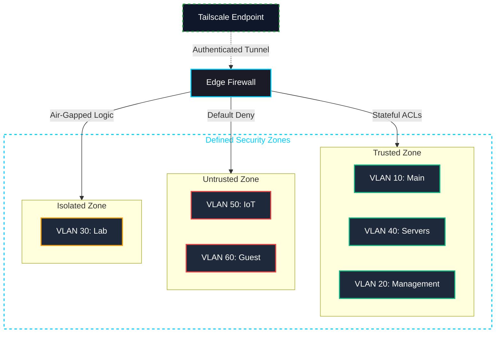

# Security Infrastructure

This directory contains the security configurations, enforcement mechanisms, and analysis outputs that define the defensive posture of the Home Network Security Lab. All policies implement the principle of least privilege across every traffic path.

---

## Security Philosophy

The core model is **VLAN segmentation with default-deny inter-zone routing**. Devices are grouped by function and trust level. No device can reach a zone above its trust boundary without an explicit firewall allow rule.

> **Rationale:** Flat networks allow a compromised IoT device to directly scan and exploit workstations. In this segmented model, a compromised device is trapped in its VLAN — unable to reach the management plane, servers, or trusted hosts without crossing an explicit firewall rule that does not exist.

---

## Security Zones Architecture

---

## Components

| Component | Directory | Description |
| :--- | :--- | :--- |
| **Firewall Rules** | [`/firewall-rules`](./firewall-rules/) | pfSense rulesets for WAN, LAN, and IoT — enforcing segmentation, ACLs, and SOC noise suppression. |
| **DNS Enforcement** | [`/dns`](./dns/) | Forced Unbound resolution, DoT blocking, DNSSEC, and Cloudflare + Quad9 encrypted upstream. |
| **VPN & Remote Access** | [`/vpn-access`](./vpn-access/) | Tailscale configuration — subnet router, exit node, and MagicDNS for zero-open-port remote access. |
| **Log Analysis** | [`/log-analysis`](./log-analysis/) | Log format reference, analysis methodology, SOC_SILENCE framework, and real-world analysis reports. |

---

## Access Control Policies

The firewall enforces the following default behaviours:

- **Intra-VLAN Traffic:** Handled at Layer 2 by the managed switch — firewall is not involved.
- **Inter-VLAN Traffic:** Routed through the edge firewall at Layer 3. All inter-zone traffic requires an explicit allow rule. Anything without a match is silently dropped.
- **Management Plane:** VLAN 20 is completely unreachable from all other zones. Only designated administrative endpoints on specific IPs may connect to management interfaces.
- **DNS:** All VLANs are forced to resolve through the local Unbound resolver. Clients cannot use external resolvers or DNS-over-TLS servers.
- **Remote Access:** All remote sessions enter via Tailscale. No inbound ports are exposed on the WAN interface beyond the Tailscale signalling port.
