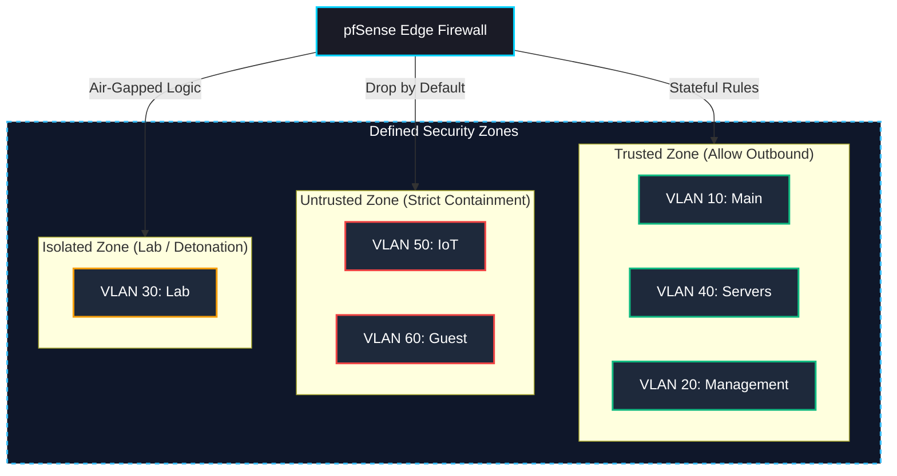

# 🛡️ Security Infrastructure

This directory contains the security configurations, firewall rulesets, and traffic analysis tools that enforce isolation and threat detection within the Home Network Security Lab.

---

## 📌 Security Philosophy

The core of this lab's security model is based on **VLAN segmentation** and the **principle of least privilege**. Rather than relying on a flat network where a compromised device has unrestricted access to the entire environment, devices are isolated into specific zones (e.g., Trusted, Untrusted, Isolated) based on their function and risk level.

> **Security Rationale:** By strictly enforcing boundaries between VLANs, the blast radius of a potential breach is minimized. An attacker compromising an IoT device is contained within the Untrusted zone, preventing lateral movement to personal computers or infrastructure management interfaces.

---

## 📊 Security Zones Architecture

The following diagram illustrates the logical separation of the network into distinct security zones, enforced by the pfSense firewall.

---

## 📑 Table of Contents

| Component | Directory | Description |
| :--- | :--- | :--- |
| **Firewall Rules** | [`/firewall-rules`](./firewall-rules/) | Core pfSense rulesets enforcing segmentation, access control lists (ACLs), and inter-VLAN routing policies. |
| **Intrusion Detection/Prevention** | [`/ids-ips`](./ids-ips/) | Suricata/Snort configurations for threat detection, malicious traffic blocking, and alerts. |
| **Adblockers & DNS Filtering** | [`/adblockers`](./adblockers/) | pfBlockerNG and Pi-hole settings for network-wide ad blocking, malicious domain filtering, and DNS sinkholing. |

---

## 🔒 Access Control Policies

The firewall strictly enforces the following default traffic behaviors:

-   **Intra-VLAN Traffic:** Handled by the MokerLink switch (Layer 2).
-   **Inter-VLAN Traffic:** Routed through the pfSense firewall (Layer 3) and subject to explicit ALLOW rules. All other traffic is silently DROPPED.
-   **Management Plane:** Access to VLAN 20 is completely restricted from all other subnets. Only designated administrative endpoints can access management interfaces.
