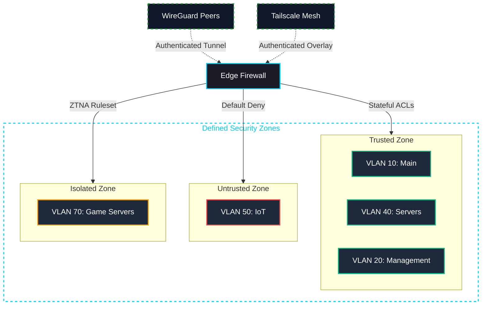

# Security Infrastructure

This directory contains the security configurations, enforcement mechanisms, and analysis outputs that define the defensive posture of the Home Network Security Lab. All policies implement the principle of least privilege across every traffic path.

---

## Security Philosophy

The core model is **VLAN segmentation with default-deny inter-zone routing**. Devices are grouped by function and trust level. No device can reach a zone above its trust boundary without an explicit firewall allow rule.

> **Rationale:** Flat networks allow a compromised IoT device to directly scan and exploit workstations. In this segmented model, a compromised device is trapped in its VLAN — unable to reach the management plane, servers, or trusted hosts without crossing an explicit firewall rule that does not exist.

---

## Security Zones Architecture

```mermaid
flowchart TB
    %% Cyber Sec Grey/Blue Theme
    classDef firewall fill:#1a1b26,stroke:#00d2ff,stroke-width:2px,color:#ffffff;
    classDef zone fill:#00000000,stroke:#00d2ff,stroke-width:2px,color:#00d2ff,stroke-dasharray: 5 5;
    classDef trusted fill:#1e293b,stroke:#10b981,stroke-width:2px,color:#ffffff;
    classDef untrusted fill:#1e293b,stroke:#ef4444,stroke-width:2px,color:#ffffff;
    classDef isolated fill:#1e293b,stroke:#f59e0b,stroke-width:2px,color:#ffffff;
    classDef vpn fill:#0f172a,stroke:#2ea043,stroke-width:2px,color:#ffffff,stroke-dasharray: 5 5;

    FW["Edge Firewall"]:::firewall
    WG["WireGuard Peers"]:::vpn -.->|"Authenticated Tunnel"| FW
    TS["Tailscale Mesh"]:::vpn -.->|"Authenticated Overlay"| FW

    subgraph Security_Zones ["Defined Security Zones"]
        direction TB

        subgraph Trusted_Zone ["Trusted Zone"]
            direction LR
            VLAN10["VLAN 10: Main"]:::trusted
            VLAN40["VLAN 40: Servers"]:::trusted
            VLAN20["VLAN 20: Management"]:::trusted
        end

        subgraph Untrusted_Zone ["Untrusted Zone"]
            direction LR
            VLAN50["VLAN 50: IoT"]:::untrusted
        end

        subgraph Isolated_Zone ["Isolated Zone"]
            direction LR
            VLAN70["VLAN 70: Game Servers"]:::isolated
        end
    end
    class Security_Zones zone;

    FW -->|"Stateful ACLs"| Trusted_Zone
    FW -->|"Default Deny"| Untrusted_Zone
    FW -->|"ZTNA Ruleset"| Isolated_Zone
```

---

## Components

| Component | Directory | Description |
| :--- | :--- | :--- |
| **Firewall Rules** | [`/firewall-rules`](./firewall-rules/) | Segmentation policy plus pfSense rulesets for WAN, LAN, IoT, and Game Server ZTNA — enforcing ACLs and SOC noise suppression. |
| **DNS Enforcement** | [`/dns`](./dns/) | Forced Unbound resolution, DoT blocking, DNSSEC, and Cloudflare + Quad9 encrypted upstream. |
| **VPN & Remote Access** | [`/vpn-access`](./vpn-access/) | Firewall-terminated WireGuard tunnels and the Tailscale mesh — subnet routing, exit node, and MagicDNS. |
| **Log Analysis** | [`/log-analysis`](./log-analysis/) | Log format reference, analysis methodology, SOC_SILENCE framework, and real-world analysis reports. |
| **Identity & Access** | [`/iam`](./iam/) | Authentik identity provider — OIDC single sign-on with passkey-enforced hypervisor administration. |
| **SIEM Showcase** | [`wazuh.md`](./wazuh.md) | Wazuh deployment overview — agent onboarding, CIS Level 2 hardening, and compliance reporting. |

---

## Access Control Policies

The firewall enforces the following default behaviours:

- **Intra-VLAN Traffic:** Handled at Layer 2 by the managed switch — firewall is not involved.
- **Inter-VLAN Traffic:** Routed through the edge firewall at Layer 3. All inter-zone traffic requires an explicit allow rule. Anything without a match is silently dropped.
- **Management Plane:** VLAN 20 is unreachable from all other zones. Only a named alias of administrative endpoints may connect to management interfaces — the single documented exception to default-deny.
- **DNS:** Untrusted segments (IoT, Game Servers) are NAT-redirected to the local Unbound resolver and cannot reach an external one. Trusted segments are permitted to use it rather than compelled. Client DNS-over-TLS is blocked everywhere, because the resolver itself already uses DoT upstream.
- **Remote Access:** Remote sessions enter either over a firewall-terminated WireGuard tunnel or the Tailscale mesh. The WireGuard listeners are the only inbound allow on the WAN interface; everything else is denied by the default-deny WAN policy.
