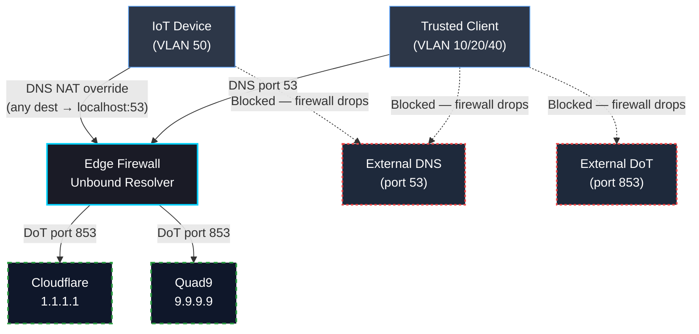

# DNS Enforcement

DNS is a security control, not just a service. In this lab, every VLAN is forced to resolve through the local Unbound resolver regardless of what DNS server a client or device firmware specifies. Upstream queries leave the firewall encrypted via DNS-over-TLS.

---

## Overview

A common evasion and exfiltration technique is **DNS bypass** — devices (especially IoT firmware) hardcode external DNS resolvers (e.g., `8.8.8.8`) to avoid network-level filtering and monitoring. This lab eliminates that vector entirely through NAT redirection and explicit blocking.

> **SOC Relevance:** Forcing all DNS through a single resolver means all DNS queries are visible, logged, and correlatable. Clients have no ability to use external resolvers for C2 communication, data exfiltration, or evasion.

---

## DNS Architecture

---

## Enforcement Mechanisms

| Mechanism | Implementation | Purpose |
| :--- | :--- | :--- |
| **Forced DNS redirect** | NAT rule: all outbound UDP/TCP port 53 → Unbound | Clients cannot use any external resolver regardless of configuration |
| **DoT blocking** | Firewall block: TCP port 853 outbound | Prevents DNS-over-TLS bypass to external servers |
| **IoT DNS NAT override** | VLAN50: DNS NAT → `127.0.0.1:53` | Neutralises firmware-hardcoded resolvers on IoT devices |
| **DNSSEC validation** | Unbound DNSSEC enabled | Detects and rejects tampered or spoofed DNS responses |

---

## Upstream Resolvers

All upstream queries from Unbound are encrypted with DNS-over-TLS:

| Resolver | Address | Reason |
| :--- | :--- | :--- |
| **Cloudflare** | `1.1.1.1` | Privacy-first anycast resolver — fast, reliable, no query logging |
| **Quad9** | `9.9.9.9` | Blocks malicious domains via threat intelligence feeds — free threat intel layer |

Both resolvers are configured for DoT (port 853) with certificate verification. Unbound does **not** forward plain-text DNS upstream.

---

## Security Rationale

**Why force all VLANs through Unbound?**
Any device that can use its own DNS resolver can evade network-level domain filtering, bypass logging, and potentially use DNS as a covert channel. Centralising resolution eliminates that surface entirely.

**Why Quad9?**
Quad9 maintains threat intelligence feeds from over 20 cyber threat intelligence partners. DNS queries for known-malicious domains are blocked at the resolver — providing a lightweight threat intel layer with no additional infrastructure.

**Why block DoT (port 853) outbound?**
Clients capable of DNS-over-TLS could otherwise bypass forced-redirect NAT rules by connecting encrypted directly to `1.1.1.1:853` or `9.9.9.9:853`. Blocking port 853 outbound closes that path.

**Why is IoT DNS NAT different?**
Standard forced-redirect works for clients that accept DHCP-assigned DNS. IoT firmware often hardcodes resolver IPs at the application layer and ignores DHCP. The NAT override on VLAN50 catches all DNS traffic regardless of destination, including those hardcoded addresses.

---

## SOC Value

- All DNS queries are logged by Unbound and visible in pfSense logs.
- DNS logs are a primary threat intelligence feed — C2 domains, malware callbacks, and phishing infrastructure often appear here before other indicators.
- Centralised resolution makes it possible to alert on: unusual query volumes, newly registered domains, known-bad domains, and DNS tunnelling patterns.
- SIEM integration (planned) will correlate DNS query logs with firewall block events for enriched detection.
