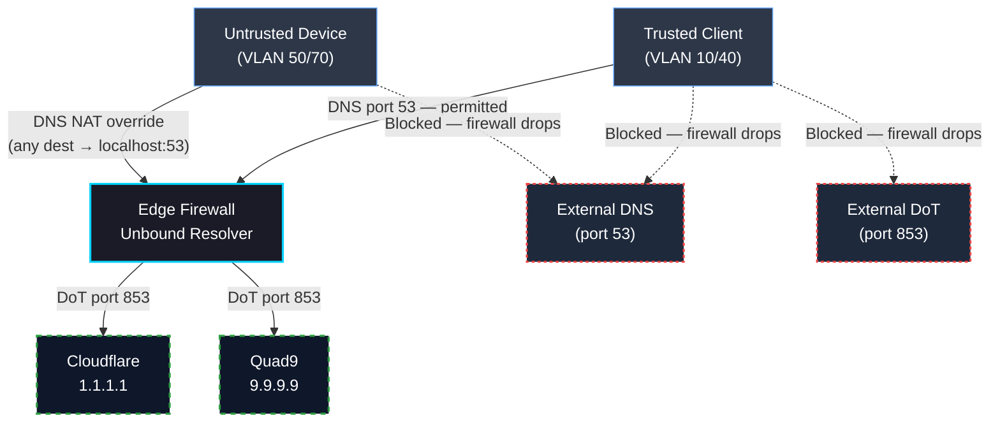

# DNS Enforcement

DNS is a security control, not just a service. In this lab, untrusted segments are forced to resolve through the local Unbound resolver regardless of what DNS server a client or device firmware specifies, and every segment is blocked from encrypted alternatives. Upstream queries leave the firewall encrypted via DNS-over-TLS.

---

## Overview

A common evasion and exfiltration technique is **DNS bypass** — devices (especially IoT firmware) hardcode external DNS resolvers (e.g., `8.8.8.8`) to avoid network-level filtering and monitoring. This lab eliminates that vector entirely through NAT redirection and explicit blocking.

> **SOC Relevance:** Forcing all DNS through a single resolver means all DNS queries are visible, logged, and correlatable. Clients have no ability to use external resolvers for C2 communication, data exfiltration, or evasion.

---

## DNS Architecture

```mermaid
flowchart TB
    %% Cyber Sec Grey/Blue Theme
    classDef device fill:#2d3748,stroke:#60a5fa,stroke-width:1px,color:#ffffff;
    classDef firewall fill:#1a1b26,stroke:#00d2ff,stroke-width:2px,color:#ffffff;
    classDef vpn fill:#0f172a,stroke:#2ea043,stroke-width:2px,color:#ffffff,stroke-dasharray: 5 5;
    classDef blocked fill:#1e293b,stroke:#ef4444,stroke-width:2px,color:#ffffff,stroke-dasharray: 3 3;

    TrustedClient["Trusted Client<br/>(VLAN 10/40)"]:::device
    IoTDevice["Untrusted Device<br/>(VLAN 50/70)"]:::device

    TrustedClient -->|"DNS port 53 — permitted"| Unbound["Edge Firewall<br/>Unbound Resolver"]:::firewall
    IoTDevice -->|"DNS NAT override<br/>(any dest → localhost:53)"| Unbound

    Unbound -->|"DoT port 853"| CF["Cloudflare<br/>1.1.1.1"]:::vpn
    Unbound -->|"DoT port 853"| Q9["Quad9<br/>9.9.9.9"]:::vpn

    ExtDNS["External DNS<br/>(port 53)"]:::blocked
    ExtDoT["External DoT<br/>(port 853)"]:::blocked

    TrustedClient -. "Blocked — firewall drops" .-> ExtDNS
    TrustedClient -. "Blocked — firewall drops" .-> ExtDoT
    IoTDevice -. "Blocked — firewall drops" .-> ExtDNS
```

---

## Enforcement Mechanisms

| Mechanism | Implementation | Purpose |
| :--- | :--- | :--- |
| **Forced DNS redirect** | NAT rule on VLAN 50 and VLAN 70: all outbound UDP/TCP port 53 → `127.0.0.1:53` | Untrusted clients cannot use any external resolver regardless of configuration |
| **Permitted DNS** | VLAN 10 and VLAN 40: allow port 53 to the segment gateway | Trusted clients use the resolver by policy; an attempt to bypass it surfaces as a block event rather than being silently rewritten |
| **DoT blocking** | Firewall block: TCP port 853 outbound, every segment | Prevents DNS-over-TLS bypass to external servers |
| **Forced NTP** | NAT rule on VLAN 10, 20, 50, 70: UDP 123 → the firewall | A device with a wrong clock can defeat certificate validation and corrupt log correlation |
| **DNSSEC validation** | Unbound DNSSEC enabled | Detects and rejects tampered or spoofed DNS responses |

> **Every VLAN's `.1` is both its gateway and its DNS resolver.** There is no separate DNS host — the firewall answers DNS for each segment it routes. That is what makes resolution enforceable at the network layer instead of the endpoint.

---

## Upstream Resolvers

All upstream queries from Unbound are encrypted with DNS-over-TLS:

| Resolver | Address | Reason |
| :--- | :--- | :--- |
| **Cloudflare** | `1.1.1.1` | Privacy-first anycast resolver — fast, reliable, no query logging |
| **Quad9** | `9.9.9.9` | Blocks malicious domains via threat intelligence feeds — free threat intel layer |

Both resolvers are configured for DoT (port 853) with certificate verification. Unbound does **not** forward plain-text DNS upstream.

---

## Security Rationale

**Why force only the untrusted VLANs?**
Any device that can use its own resolver can evade network-level filtering, bypass logging, and use DNS as a covert channel — so resolution must be centralised. But NAT-redirecting DNS silently rewrites a client's traffic, which hides misconfiguration and breaks clients that validate the resolver they reached. On IoT and game-server segments that cost is worth paying, because the firmware cannot be trusted to cooperate. On trusted segments it is not: those are permitted to reach the resolver instead, so a host attempting to bypass it produces a visible block event rather than a silent rewrite. Both routes end at the same resolver; only the enforcement mechanism differs.

**Why Quad9?**
Quad9 maintains threat intelligence feeds from over 20 cyber threat intelligence partners. DNS queries for known-malicious domains are blocked at the resolver — providing a lightweight threat intel layer with no additional infrastructure.

**Why block DoT (port 853) outbound?**
Clients capable of DNS-over-TLS could otherwise bypass forced-redirect NAT rules by connecting encrypted directly to `1.1.1.1:853` or `9.9.9.9:853`. Blocking port 853 outbound closes that path — and costs nothing in privacy terms, because the resolver already forwards upstream over DoT. The encryption a client would gain by running its own DoT already exists one hop later; all the client would actually gain is invisibility to the firewall.

**Why is the IoT DNS NAT different?**
Standard forced-redirect works for clients that accept DHCP-assigned DNS. IoT firmware often hardcodes resolver IPs at the application layer and ignores DHCP entirely. The NAT override on VLAN 50 catches all DNS traffic regardless of destination, including those hardcoded addresses. The same override is applied to VLAN 70 for the same reason — an internet-facing workload is not trusted to choose its own resolver.

---

## SOC Value

- All DNS queries are logged by Unbound and visible in pfSense logs.
- DNS logs are a primary threat intelligence feed — C2 domains, malware callbacks, and phishing infrastructure often appear here before other indicators.
- Centralised resolution makes it possible to alert on: unusual query volumes, newly registered domains, known-bad domains, and DNS tunnelling patterns.
- SIEM forwarding of DNS query logs is the next step; the Wazuh manager is deployed and already ingesting host agents, so correlating resolver activity with firewall block events is a matter of adding the log source and decoders. See [`../wazuh.md`](../wazuh.md).
