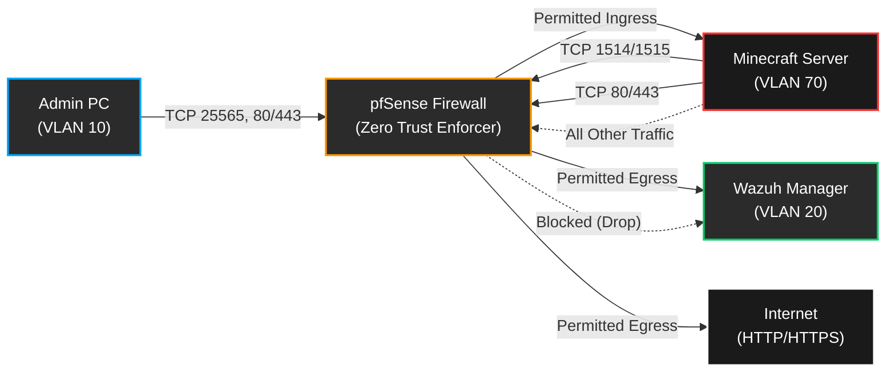

# 🎮 Game Server Zero Trust Architecture (ZTNA)

This document outlines the strict firewall rules and Zero Trust Network Access (ZTNA) policies applied to the **Game Servers VLAN (VLAN 70)**, specifically isolating the Minecraft server while permitting required management and SIEM traffic.

---

## 🛡️ Network Segment Isolation

The Game Server resides in VLAN 70 (`192.168.70.0/24`). By default, all inbound and outbound traffic to this subnet is implicitly denied.

> **Security Rationale:** Game servers are frequently targeted and can contain vulnerabilities (e.g., Log4j). Placing them in an isolated VLAN with strict ingress/egress filtering ensures that if the server is compromised, lateral movement to critical infrastructure (like VLAN 20 or VLAN 40) is blocked.

---

## 🚦 Firewall Rulesets & Permitted Traffic

The following exceptions are explicitly defined in the pfSense firewall ruleset to allow necessary operational traffic.

### Inbound (Ingress to Game Server)

| Source | Destination | Protocol | Port | Description |
| :--- | :--- | :--- | :--- | :--- |
| **Admin PC** (`192.168.10.10`) | **Game Server** (`192.168.70.x`) | TCP | `25565` | Minecraft game client access |
| **Admin PC** (`192.168.10.10`) | **Game Server** (`192.168.70.x`) | TCP | `80/443` | Web panel/management interface access |

### Outbound (Egress from Game Server)

| Source | Destination | Protocol | Port | Description |
| :--- | :--- | :--- | :--- | :--- |
| **Game Server** (`192.168.70.x`) | **Wazuh Manager** (`192.168.20.x`) | TCP | `1514/1515` | Wazuh agent log forwarding and registration |
| **Game Server** (`192.168.70.x`) | **WAN / Internet** | TCP | `80/443` | Restricted internet access for updates and mods |

> **Security Rationale:** Allowing outbound traffic *only* to the Wazuh Manager ensures logs are securely transmitted to the SIEM without exposing the management VLAN to other traffic. Restricting outbound internet to HTTP/HTTPS prevents the server from acting as a participant in generic botnets or participating in unauthorized protocols if compromised.

---

## 🗺️ Zero Trust Traffic Flow

