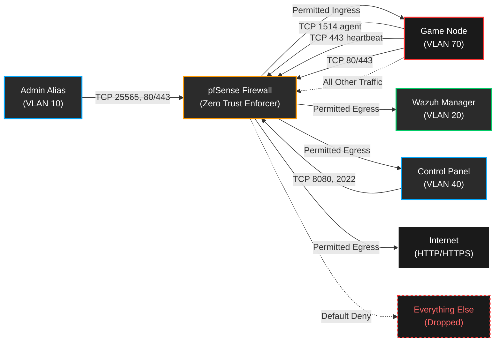

# 🎮 Game Server Zero Trust Architecture (ZTNA)

This document outlines the strict firewall rules and Zero Trust Network Access (ZTNA) policies applied to the **Game Servers VLAN (VLAN 70)**, isolating the game workload while permitting the small set of management and SIEM flows it genuinely needs.

---

## 🛡️ Network Segment Isolation

The Game Server resides in VLAN 70 (`192.168.70.0/24`). By default, all inbound and outbound traffic to this subnet is implicitly denied.

> **Security Rationale:** Game servers are frequently targeted and can contain vulnerabilities (e.g. Log4j). Placing them in an isolated VLAN with strict ingress/egress filtering ensures that if the server is compromised, lateral movement to critical infrastructure (like VLAN 20 or VLAN 40) is blocked.

### Split control plane

The management panel and the workload it controls are deliberately **not** in the same segment. The panel runs on VLAN 40 (Servers); the game node runs alone on VLAN 70. This means compromising the internet-facing node yields no access to the panel's database, user accounts, or the other workloads it could otherwise orchestrate — the attacker lands in a segment containing exactly one host.

---

## 🚦 Firewall Rulesets & Permitted Traffic

The following exceptions are explicitly defined in the pfSense firewall ruleset to allow necessary operational traffic.

### Inbound (Ingress to Game Server)

| Source | Destination | Protocol | Port | Description |
| :--- | :--- | :--- | :--- | :--- |
| **`Grv_Trusted_Devices`** (admin alias, VLAN 10) | **Game Node** (VLAN 70) | TCP | `25565` | Game client access from administrative endpoints |
| **`Grv_Trusted_Devices`** (admin alias, VLAN 10) | **Game Node** (VLAN 70) | TCP | `80/443` | Direct node management when the panel is unavailable |
| **Control Panel** (VLAN 40) | **Game Node** (VLAN 70) | TCP | `8080` | Node daemon API — the panel orchestrates the workload |
| **Control Panel** (VLAN 40) | **Game Node** (VLAN 70) | TCP | `2022` | SFTP for server file management |

Ingress is defined by named alias rather than by a literal address, so adding or retiring an administrative endpoint is a change to the alias, not to five separate rules.

### Outbound (Egress from Game Server)

| Source | Destination | Protocol | Port | Description |
| :--- | :--- | :--- | :--- | :--- |
| **Game Node** (VLAN 70) | **Wazuh Manager** (VLAN 20) | TCP | `1514` | Wazuh agent log forwarding |
| **Game Node** (VLAN 70) | **Wazuh Manager** (VLAN 20) | TCP | `1515` | Agent enrollment — rule retained but **disabled** after onboarding |
| **Game Node** (VLAN 70) | **Control Panel** (VLAN 40) | TCP | `443` | Node heartbeat back to the panel |
| **Game Node** (VLAN 70) | **WAN / Internet** | TCP | `80/443` | Restricted internet access for updates and mods |
| **Game Node** (VLAN 70) | **Firewall** | UDP | `53`, `123` | NAT-forced DNS and NTP — no external resolver or time source |

> **Security Rationale:** Allowing outbound traffic *only* to the Wazuh Manager's agent port ensures logs reach the SIEM without exposing the rest of the management VLAN. Restricting outbound internet to HTTP/HTTPS prevents a compromised server from joining a botnet or speaking unauthorized protocols.

> **On the disabled enrollment rule:** agent registration (`1515`) is needed exactly once. Leaving it permanently open would give a compromised node a second path into the SIEM, so the rule is kept in the ruleset in a disabled state — visible during review, inert during operation, and trivially re-enabled if the agent ever needs re-registering.

### No inbound from the internet

Two WAN port forwards previously exposed this node directly for external play. Both are now **disabled** — external access goes through the VPN instead. The node is internet-*reachable* only in the outbound direction; nothing on the WAN can initiate a connection to it. See [`wan-rules.md`](./wan-rules.md).

---

## 🗺️ Zero Trust Traffic Flow

```mermaid
graph LR
    %% Styling for dark hacker theme
    classDef isolated fill:#1a1a1a,stroke:#ff3333,stroke-width:2px,color:#ffffff
    classDef admin fill:#2b2b2b,stroke:#00a8ff,stroke-width:2px,color:#ffffff
    classDef siem fill:#2b2b2b,stroke:#00cc66,stroke-width:2px,color:#ffffff
    classDef firewall fill:#2b2b2b,stroke:#ff9900,stroke-width:2px,color:#ffffff
    classDef internet fill:#1a1a1a,stroke:#ffffff,stroke-width:2px,color:#ffffff

    classDef blocked fill:#1a1a1a,stroke:#ff3333,stroke-width:2px,color:#ff6666,stroke-dasharray: 4 4

    ADMIN["Admin Alias<br/>(VLAN 10)"]:::admin
    PANEL["Control Panel<br/>(VLAN 40)"]:::admin
    GAME["Game Node<br/>(VLAN 70)"]:::isolated
    WAZUH["Wazuh Manager<br/>(VLAN 20)"]:::siem
    FW["pfSense Firewall<br/>(Zero Trust Enforcer)"]:::firewall
    WAN["Internet<br/>(HTTP/HTTPS)"]:::internet
    DROP["Everything Else<br/>(Dropped)"]:::blocked

    ADMIN -->|"TCP 25565, 80/443"| FW
    PANEL -->|"TCP 8080, 2022"| FW
    FW -->|"Permitted Ingress"| GAME

    GAME -->|"TCP 1514 agent"| FW
    FW -->|"Permitted Egress"| WAZUH

    GAME -->|"TCP 443 heartbeat"| FW
    FW -->|"Permitted Egress"| PANEL

    GAME -->|"TCP 80/443"| FW
    FW -->|"Permitted Egress"| WAN

    %% Visual indicator of block
    GAME -.->|"All Other Traffic"| FW
    FW -.->|"Default Deny"| DROP
```
