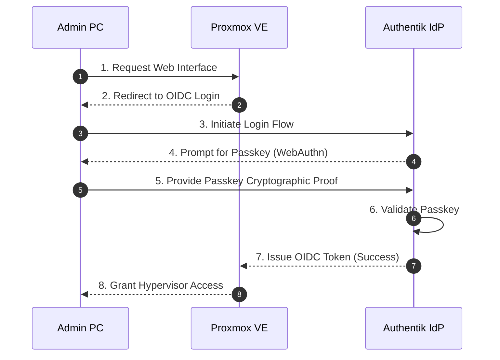

# 🔐 Authentik Identity & Access Management (IAM)

This document outlines the deployment of Authentik as an Identity Provider (IdP) for the lab, specifically focusing on its integration with Proxmox VE using OpenID Connect (OIDC) and the implementation of passkey-based Zero Trust authentication.

---

## 🏛️ Architecture & Deployment

Authentik is hosted as a virtual machine on **Ubuntu Server Pro** within the isolated **Management VLAN (VLAN 20)**. The OS is hardened using the Ubuntu Security Guide (USG) and utilizes Canonical Livepatch for non-disruptive security patching. It serves as the centralized authentication gateway for critical infrastructure services.

### DNS & TLS Certificate Routing
To ensure secure communication between internal services without exposing them to the internet, traffic is routed locally using pfSense:
* **Local DNS Overrides:** Configured in pfSense to resolve internal hostnames (e.g., `auth.local.domain`, `pve.local.domain`) to their respective VLAN 20 IP addresses.
* **pfSense CA Certificates:** Self-signed or locally trusted certificates managed by the pfSense Certificate Authority are deployed to Authentik and Proxmox to secure OIDC exchanges over HTTPS.

> **Security Rationale:** Relying on local DNS overrides and internal CA certificates ensures that authentication traffic never traverses the public internet, preventing interception while maintaining strict TLS encryption standards internally.

---

## 🔑 Proxmox OIDC Integration

Proxmox VE is configured to delegate authentication to Authentik using OpenID Connect.

1. **Authentik Setup:** An OIDC Provider and Application were created in Authentik, explicitly defining redirect URIs for the Proxmox host.
2. **Proxmox Setup:** A new OIDC Realm was configured under `Datacenter -> Permissions -> Realms`, linking back to the Authentik endpoints.

> **Security Rationale:** Centralizing authentication through an IdP like Authentik removes the need to manage local Proxmox user credentials, enforcing a unified password policy and enabling advanced authentication flows like passkeys.

---

## 🛡️ Passkey Zero-Trust Flow

To protect administrative access to the hypervisor, the Authentik application flow enforces the use of Passkeys (WebAuthn/FIDO2).

Instead of relying on passwords, administrators authenticate using a hardware security key or biometric passkey.

> **Security Rationale:** Passkeys are inherently resistant to phishing and credential stuffing. Enforcing them for hypervisor access aligns with Zero Trust principles, ensuring that even if an attacker compromises the Management VLAN, they cannot access Proxmox without physical possession of the administrator's security key.