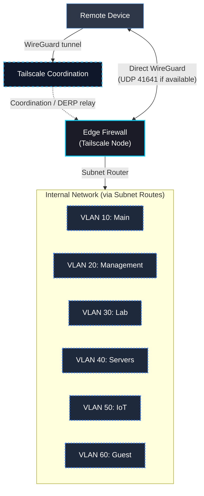

# VPN & Remote Access

Remote access to this lab uses **Tailscale** — a zero-config WireGuard-based mesh VPN. No inbound ports are exposed on the WAN. No certificates are managed manually. All remote sessions are authenticated, audited, and subject to the same DNS enforcement as local clients.

---

## Overview

Traditional VPN deployments require exposing a listening port on the WAN interface (OpenVPN UDP 1194, WireGuard UDP 51820). This creates a permanent, internet-facing attack surface that must be continuously patched and monitored.

Tailscale eliminates this by using a coordination server and NAT traversal. The firewall connects outbound to the Tailscale network — no inbound connection from the internet is required to establish a remote session.

> **Security Posture:** The only inbound WAN allow rule is `UDP 41641` — Tailscale's direct connection port. All other inbound traffic is denied by the default-deny WAN policy. Remote access is invisible to internet-wide scanners.

---

## Access Architecture

---

## Roles Configured

| Role | What It Does | Security Impact |
| :--- | :--- | :--- |
| **Subnet Router** | Advertises all internal VLANs (`192.168.10–60.0/24`) into the Tailscale network | Remote devices can reach any internal VLAN as if locally connected |
| **Exit Node** | Routes all remote device internet traffic out through the home WAN | Full traffic tunnel for trusted remote devices — useful when on untrusted networks |
| **MagicDNS Resolver** | pfSense Unbound is configured as the tailnet DNS resolver | Remote sessions resolve DNS through Unbound — DNS enforcement applies to remote clients too |

---

## Security Model

| Property | Implementation |
| :--- | :--- |
| **Authentication** | Tailscale device + user authentication required before network access |
| **No open WAN ports** | Remote access initiated outbound from the firewall — no inbound listener exposed |
| **DNS enforcement** | MagicDNS routes remote client DNS through Unbound — same controls as local clients |
| **Audit trail** | All remote sessions logged in Tailscale admin console + pfSense firewall logs |
| **Key rotation** | WireGuard session keys rotate automatically — no manual certificate lifecycle |
| **DERP fallback** | If direct UDP path is unavailable, traffic relays through Tailscale's DERP servers (encrypted) |

---

## Comparison: Tailscale vs Traditional VPN

| Aspect | Traditional VPN (OpenVPN/WireGuard) | Tailscale |
| :--- | :--- | :--- |
| **WAN exposure** | Open port (1194 or 51820) | No inbound port required |
| **Internet-scannable** | Yes — port visible to Shodan/Censys | No — zero WAN footprint |
| **Certificate management** | Manual CA, cert renewal | Handled by Tailscale coordination |
| **NAT traversal** | Complex (dynamic DNS, DDNS) | Automatic via DERP relay network |
| **Key rotation** | Manual or scripted | Automatic |
| **Multi-device** | Each device needs manual config | Devices join the tailnet automatically |

---

## SOC Value

- Remote access events are visible in both Tailscale's admin audit log and pfSense's firewall logs.
- No anonymous inbound connections are possible — every session has an authenticated identity.
- DNS enforcement on remote sessions means remote clients cannot bypass Unbound even when off-site.
- Exit node traffic is logged at the WAN egress — any suspicious activity from remote devices is captured.
