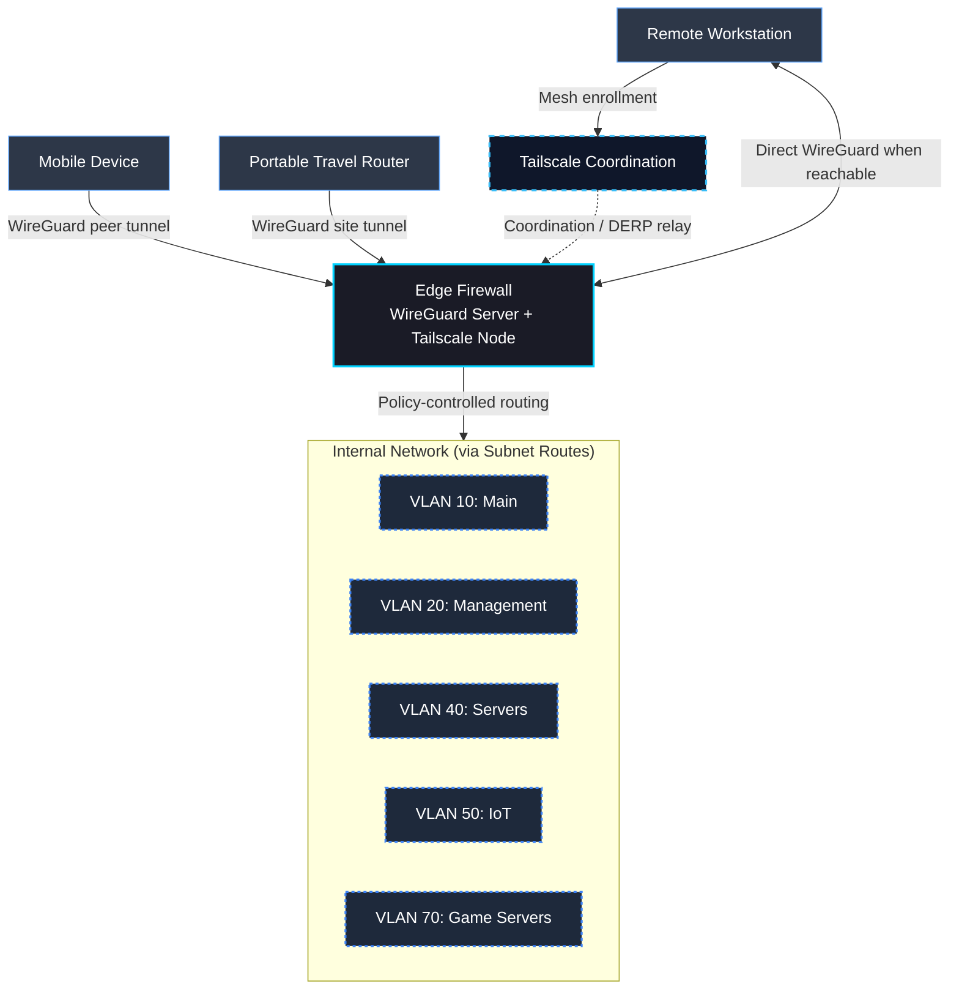

# VPN & Remote Access — WireGuard + Tailscale

Remote access to this lab runs over **two deliberately different models**: WireGuard tunnels terminated directly on the edge firewall, and a **Tailscale** mesh overlay. Both are authenticated, both are logged, and both inherit the same DNS enforcement as local clients.

---

## Overview

There is a standard argument that a mesh VPN is strictly safer than a self-hosted one, because it exposes no inbound port. That argument is real, but it is not free — it makes remote access depend on a third-party coordination service, and it puts device authorization in someone else's control plane.

This lab runs both, because the two models fail differently:

- **Firewall-terminated WireGuard** keeps the entire authentication path in-house. There is no third party in the trust chain, and access continues to work if an external service is unavailable. The cost is a UDP listener on the WAN interface.
- **Tailscale mesh** removes the need for a listener and handles NAT traversal and key rotation automatically. The cost is a dependency on an external coordination plane.

> **Security Posture:** The WireGuard listeners are the **only** inbound allow on the WAN interface. Every other inbound connection is dropped by the default-deny WAN policy — including the game-server port forwards that were previously published and are now **disabled**. See [WAN rules](../firewall-rules/wan-rules.md).

---

## Remote Access Paths

| Path | Type | Terminates On | Purpose |
| :--- | :--- | :--- | :--- |
| **Mobile tunnel** | WireGuard peer | Edge firewall | Phone access to internal services while away from the network |
| **Portable router tunnel** | WireGuard peer | Edge firewall | A travel router that brings a whole remote site onto the lab network |
| **Mesh overlay** | Tailscale node | Edge firewall (subnet router + exit node) | Workstation access without depending on an inbound listener |

A WireGuard listener is an internet-visible UDP endpoint. It is an acceptable exposure precisely because WireGuard is silent to unauthenticated traffic: a packet without a valid key produces no response at all, so the port does not answer scanners the way a TCP service would.

---

## Access Architecture

```mermaid
flowchart TB
    %% Cyber Sec Grey/Blue Theme
    classDef device fill:#2d3748,stroke:#60a5fa,stroke-width:1px,color:#ffffff;
    classDef internet fill:#0f172a,stroke:#38bdf8,stroke-width:2px,color:#ffffff,stroke-dasharray: 5 5;
    classDef firewall fill:#1a1b26,stroke:#00d2ff,stroke-width:2px,color:#ffffff;
    classDef vlan fill:#1e293b,stroke:#3b82f6,stroke-width:2px,stroke-dasharray: 3 3,color:#ffffff;
    classDef vpn fill:#0f172a,stroke:#2ea043,stroke-width:2px,color:#ffffff,stroke-dasharray: 5 5;

    Mobile["Mobile Device"]:::device
    TravelRouter["Portable Travel Router"]:::device
    Workstation["Remote Workstation"]:::device
    TailscaleCloud["Tailscale Coordination"]:::internet
    EdgeFW["Edge Firewall<br/>WireGuard Server + Tailscale Node"]:::firewall

    Mobile -->|"WireGuard peer tunnel"| EdgeFW
    TravelRouter -->|"WireGuard site tunnel"| EdgeFW
    Workstation -->|"Mesh enrollment"| TailscaleCloud
    TailscaleCloud -.->|"Coordination / DERP relay"| EdgeFW
    Workstation <-->|"Direct WireGuard when reachable"| EdgeFW

    subgraph Internal ["Internal Network (via Subnet Routes)"]
        direction LR
        VLAN10["VLAN 10: Main"]:::vlan
        VLAN20["VLAN 20: Management"]:::vlan
        VLAN40["VLAN 40: Servers"]:::vlan
        VLAN50["VLAN 50: IoT"]:::vlan
        VLAN70["VLAN 70: Game Servers"]:::vlan
    end

    EdgeFW -->|"Policy-controlled routing"| Internal
```

Note that reaching a VLAN over a tunnel does **not** bypass segmentation. Tunnel clients are subject to the same inter-VLAN policy as any other source — the VPN provides a path onto the network, not a licence to cross it.

---

## Roles Configured

| Role | What It Does | Security Impact |
| :--- | :--- | :--- |
| **WireGuard Server** | Terminates peer tunnels on the firewall; each peer is a distinct key with its own tunnel subnet | Authentication and revocation stay entirely in-house — removing a peer is a local config change |
| **Subnet Router** | Advertises the internal VLANs (`192.168.10.0/24`, `.20.0/24`, `.40.0/24`, `.50.0/24`, `.70.0/24`) into the mesh | Remote devices reach internal segments through firewall policy, not around it |
| **Exit Node** | Routes remote device internet traffic out through the home WAN | Full traffic tunnel for trusted remote devices — useful on untrusted networks |
| **Pushed Resolver** | The firewall's Unbound instance is the DNS resolver for both tunnel types (MagicDNS on the mesh side) | Remote sessions resolve through Unbound — DNS enforcement applies off-site too |

---

## Security Model

| Property | WireGuard Tunnels | Tailscale Mesh |
| :--- | :--- | :--- |
| **Authentication** | Static public-key peers; unknown keys get no response | Device + user authentication before the node joins |
| **WAN exposure** | UDP listener, silent to unauthenticated packets | No inbound listener required |
| **Trust chain** | Entirely self-hosted | Depends on the Tailscale coordination plane |
| **Key rotation** | Manual peer lifecycle | Automatic session key rotation |
| **NAT traversal** | Requires a reachable WAN endpoint | Automatic, with DERP relay fallback |
| **DNS enforcement** | Firewall pushed as client resolver | MagicDNS points at the same resolver |
| **Audit trail** | pfSense firewall and tunnel logs | Tailscale admin console + pfSense logs |
| **Failure mode** | Unreachable if the WAN endpoint is down | Unreachable if the coordination plane is unavailable |

> **Why keep both:** They fail independently. A self-hosted tunnel survives an outage of an external service; a mesh overlay survives a change of WAN address or a network that blocks inbound UDP. Running one of each removes the single point of failure that either model has on its own.

---

## SOC Value

- Remote access events are visible in both the mesh admin audit log and pfSense's firewall logs.
- No anonymous inbound connections are possible — every session has an authenticated identity, either a known WireGuard key or an enrolled mesh device.
- DNS enforcement on remote sessions means remote clients cannot bypass Unbound even when off-site.
- Exit node and tunnel traffic is logged at the WAN egress — suspicious activity from remote devices is captured.
- The single inbound allow makes the WAN ruleset trivially auditable: one rule to justify, everything else denied.
