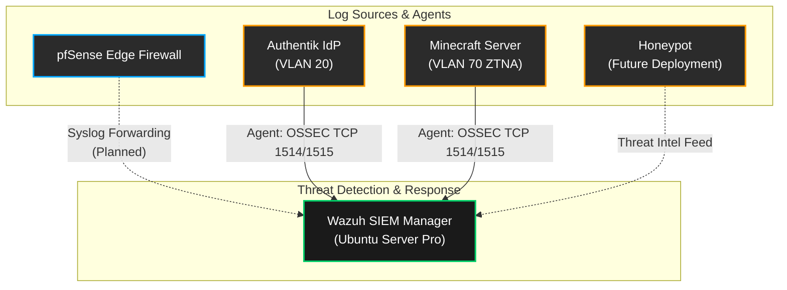

# 👁️ Wazuh SIEM & Threat Intelligence (Recruiter Showcase)

Welcome! If you are a technical recruiter or hiring manager reviewing this repository, this document highlights the design, implementation, and capabilities of the **Wazuh Security Information and Event Management (SIEM)** platform deployed within this home lab.

This deployment demonstrates practical experience in building enterprise-grade security monitoring, strict compliance hardening, and zero-trust logging architecture.

---

## 🎯 High-Level Overview

Wazuh is deployed as the central nervous system for threat detection across the lab infrastructure. It actively ingests logs, monitors file integrity, and provides vulnerability detection for the isolated VLANs, Virtual Machines, and the edge pfSense firewall.

### Key Achievements
* **Enterprise Hardening:** Achieved a **92% CIS (Center for Internet Security) Level 2 Server score** on the underlying OS.
* **Resilient Architecture:** Implemented security-based partition schemes (dedicated `/var/ossec` and `/var/log/audit`) to prevent denial-of-service conditions via disk exhaustion.
* **Zero-Downtime Patching:** Deployed on **Ubuntu Server Pro** utilizing Canonical Livepatch for non-disruptive kernel security updates and the Ubuntu Security Guide (USG) for compliance auditing.

👉 *For deep-dive technical documentation on the storage partition schema and CIS compliance steps, see the technical guide:* [Wazuh Hardening & Partitioning](./log-analysis/wazuh-hardening.md)

---

## 🏗️ Architecture & Integration

The Wazuh Manager resides in the strictly controlled **Management VLAN (VLAN 20)** on the Proxmox Hypervisor. It communicates with endpoints across the network through specific firewall pinholes.

---

## 🛡️ Core Capabilities Demonstrated

By deploying and managing Wazuh in this lab environment, I have developed and practiced the following Security Operations (SecOps) skills:

1. **Log Aggregation & Correlation:** Centralizing event data from multiple endpoints across segmented networks, ensuring visibility into isolated Zero Trust segments (like the Game Server VLAN).
2. **Vulnerability Detection (CVEs):** Utilizing the Wazuh Vulnerability Detector module to identify unpatched software across monitored VMs.
3. **File Integrity Monitoring (FIM):** Tracking unauthorized modifications to critical system files (`/etc`, `/var`, `/bin`) on the host machines.
4. **Compliance Management:** Validating endpoint configurations against PCI-DSS, GDPR, and CIS benchmarks natively through Wazuh dashboards.
5. **Custom Log Parsing (Roadmap):** Developing custom decoders and alerting rules to specifically interpret pfSense firewall drops and custom application logs (e.g., Minecraft authentication attempts).

---

## 💡 Why This Matters

A well-deployed SIEM is only as secure as its host. By running Wazuh on a CIS-hardened, Livepatch-enabled Ubuntu Pro server with a defense-in-depth partition layout, this lab mirrors the rigorous security standards required in Fortune 500 production environments.

It proves not only the ability to *use* a security tool, but the operational maturity to *secure the security tool itself*.