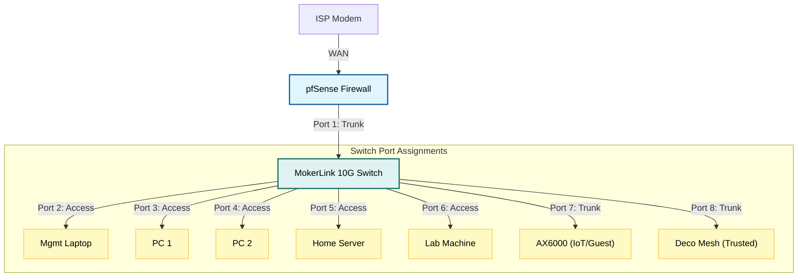

# 🎛️ VLAN Setup Guide (MokerLink 10G)

## 📌 Overview

This document describes how VLANs are implemented in the home lab using a **MokerLink 10G0800GTM** managed switch and **pfSense firewall**. The configuration enables **network segmentation**, improves **security posture**, and supports lab experimentation without impacting trusted devices.

The **pfSense firewall** performs inter-VLAN routing (Layer 3), while the **managed switch** handles VLAN tagging and port membership (Layer 2).

---

## 🔌 Network Topology Flow

**Roles:**
-   **pfSense:** DHCP per VLAN, Firewall filtering, DNS resolution.
-   **Switch:** VLAN tagging (802.1Q), Port isolation.

---

## 🌐 VLAN Layout

| VLAN ID | VLAN Name   | Subnet            | Gateway       | Primary Use Case                          |
| :------ | :---------- | :---------------- | :------------ | :---------------------------------------- |
| **10**  | `MAIN`      | `192.168.10.0/24` | 192.168.10.1  | PCs, laptops, phones, daily devices       |
| **20**  | `MGMT`      | `192.168.20.0/24` | 192.168.20.1  | pfSense, switch, AP management            |
| **30**  | `LAB`       | `192.168.30.0/24` | 192.168.30.1  | Security lab, VMs, attack testing         |
| **40**  | `SERVERS`   | `192.168.40.0/24` | 192.168.40.1  | NAS, game servers, service hosts          |
| **50**  | `IOT`       | `192.168.50.0/24` | 192.168.50.1  | Smart home, printers, TVs, cameras        |
| **60**  | `GUEST`     | `192.168.60.0/24` | 192.168.60.1  | Guest internet-only access                |

---

## ⚙️ pfSense Configuration

### 1. Create VLANs
**Navigate:** `Interfaces` → `Assignments` → `VLANs`

Add VLANs on the LAN parent interface (e.g., `igb1`, `ix0`):
-   **VLAN Tag:** `10`
-   **Description:** `VLAN10_MAIN`
-   *Repeat for VLANs 20, 30, 40, 50, and 60.*

> **Security Note:** Ensure the parent interface itself is not used for untagged traffic if possible, to prevent VLAN hopping attacks.

### 2. Assign Interfaces
**Navigate:** `Interfaces` → `Assignments`

1.  Add each VLAN as a new interface.
2.  Enable each interface.
3.  Assign **Static IPv4**:
    *   `VLAN10_MAIN` → `192.168.10.1/24`
    *   `VLAN20_MGMT` → `192.168.20.1/24`
    *   ...and so on.

### 3. Enable DHCP per VLAN
**Navigate:** `Services` → `DHCP Server`

Enable DHCP individually for each VLAN interface to ensure devices get IPs in the correct range.

**Recommended Pool Layout:**
*   **Gateway:** `.1`
*   **Static Infrastructure:** `.2` – `.20` (Switch, APs, Servers)
*   **Reserved Clients:** `.21` – `.99` (Printers, specific PCs)
*   **DHCP Pool:** `.100` – `.199` (Dynamic clients)

---

## 🖧 Switch Configuration

### 1. Firewall Uplink Port (Trunk)
The port connected to pfSense must carry traffic for *all* VLANs.

-   **Mode:** Trunk (Tag All)
-   **Tagged VLANs:** 10, 20, 30, 40, 50, 60
-   **Untagged VLAN:** None (or Native VLAN 1 if required by switch)

> **Why?** This single cable acts as the "highway" carrying multiple separated "lanes" of traffic to the router.

### 2. Access Ports (End Devices)
Ports connected to PCs, Servers, or IoT devices should only carry traffic for *one* VLAN.

**Example: PC on Main VLAN**
-   **Mode:** Access
-   **PVID:** 10
-   **Untagged VLAN:** 10
-   **Tagged VLANs:** None

**Example: IoT Camera**
-   **Mode:** Access
-   **PVID:** 50
-   **Untagged VLAN:** 50

> **Security Benefit:** An "Access" port strips the VLAN tag before sending data to the device. The device has no idea it is on a VLAN, preventing it from hopping to another network.

### 3. Access Point Ports (Hybrid/Trunk)
If the AP supports SSID-to-VLAN mapping (like Omada/Unifi), it needs a Trunk port.

-   **Mode:** Trunk
-   **Native/Untagged VLAN:** 20 (Management IP of the AP)
-   **Tagged VLANs:** 10 (Main SSID), 50 (IoT SSID), 60 (Guest SSID)

---

## 🔌 Recommended Switch Port Layout

| Switch Port | Device / Connection        | VLAN Mode | Assignment                       | Security Purpose |
| :---------- | :------------------------- | :-------- | :------------------------------- | :--------------- |
| **TE1**     | pfSense Firewall Uplink    | **Trunk** | Tagged: 10-60                    | Inter-VLAN routing pipeline. |
| **TE2**     | Management Station         | **Access**| VLAN 20 (MGMT)                   | restrict admin access to mgmt subnet. |
| **TE3**     | PC 1                       | **Access**| VLAN 10 (MAIN)                   | Trust boundary for personal data. |
| **TE4**     | PC 2                       | **Access**| VLAN 10 (MAIN)                   | Trust boundary for personal data. |
| **TE5**     | Server                     | **Access**| VLAN 40 (SERVERS)                | Controls access to sensitive data. |
| **TE6**     | Lab Machine                | **Access**| VLAN 30 (LAB)                    | Isolates malware/testing traffic. |
| **TE7**     | AX6000 (IoT/Guest AP)      | **Trunk** | Tagged: 50, 60 / Native: 20      | Separates IoT and Guest Wi-Fi traffic. |
| **TE8**     | Deco Mesh (Main AP)        | **Trunk** | Tagged: 10 / Native: 20          | Main trusted Wi-Fi access. |

---

## 📝 DHCP Reservation Best Practice

To maintain a stable infrastructure, assign static IPs via DHCP reservation.

| Device Type | Suggested IP Range | Example |
| :---------- | :----------------- | :------ |
| **Gateway** | `.1` | `192.168.20.1` |
| **Switch**  | `.2` | `192.168.20.2` |
| **AP**      | `.3` | `192.168.20.3` |
| **Servers** | `.10` – `.19` | `192.168.40.10` |
| **Printers**| `.20` – `.29` | `192.168.50.20` |
| **Cameras** | `.30`+ | `192.168.50.31` |

**Configured via:** `Status` → `DHCP Leases` → `Add Static Mapping`

---

## ✅ Validation Checklist

After configuration, verify the following:

-   [ ] **IP Assignment:** Connect a PC to Port 3. Does it get a `192.168.10.x` IP?
-   [ ] **IoT Isolation:** Connect a PC to Port 7. Does it get a `192.168.50.x` IP?
-   [ ] **Internet Access:** Can VLAN 10 and 50 access `8.8.8.8`?
-   [ ] **Inter-VLAN Block:** Can the IoT PC (Port 7) Ping the Main PC (Port 3)? (Should fail).
-   [ ] **Management Access:** Can the Main PC access the Switch UI at `192.168.20.2`? (Should pass if rules allow).

---

## 🔧 Troubleshooting Tips

### ❌ No DHCP Lease?
*   **Switch:** Check if the PVID matches the VLAN ID.
*   **Firewall:** Ensure the DHCP Server service is running for that specific interface.

### ❌ No Internet?
*   **Firewall:** Check "Outbound NAT" rules (usually automatic).
*   **Rules:** Ensure there is an "Allow Any to Any" (or specific) rule on the VLAN interface.

### ❌ Cannot Access Management VLAN?
*   **Rules:** You explicitly need a firewall rule on `VLAN10_MAIN` allowing traffic to `VLAN20_MGMT`.
*   **Block:** Ensure there isn't a floating rule blocking RFC1918 traffic indiscriminately.

---

## 🛡️ Security Notes

This configuration implements **Defense in Depth**:

1.  **Layer 2 Isolation:** Devices physically cannot see each other's broadcast traffic.
2.  **Management Plane Protection:** The switch management interface is only listening on VLAN 20, keeping it invisible to IoT devices.
3.  **Reduced Blast Radius:** If a device on Port 7 is hacked, the attacker is confined to VLAN 50.

---

## 🚀 Conclusion

This VLAN setup provides **enterprise-style segmentation** suitable for cybersecurity learning, testing, and safe home infrastructure operation. By strictly defining port roles, we ensure that security policy is enforced at the physical edge of the network.
